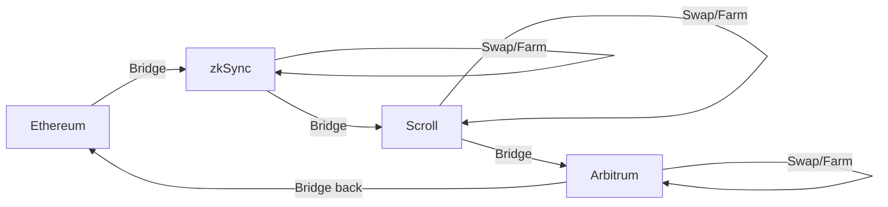

# Multi-Protocol Airdrop Farming Strategy Guide

## Overview

This guide outlines strategies for efficiently farming airdrops across multiple protocols simultaneously. The key is to maximize engagement while maintaining capital efficiency and managing risks across different chains and protocols.

## Core Principles

### 1. Capital Efficiency
- **Bridge Optimization**: Minimize bridging costs by planning multi-protocol routes
- **Capital Recycling**: Use same capital across protocols via strategic bridging
- **Yield Stacking**: Combine farming with lending/staking yields

### 2. Time Management
- **Batch Operations**: Group similar activities across protocols
- **Automated Scheduling**: Use the scheduler for routine tasks
- **Priority Ranking**: Focus on highest-potential protocols

### 3. Risk Distribution
- **Protocol Diversification**: Never >25% exposure to single protocol
- **Chain Diversification**: Spread across L1s and L2s
- **Asset Diversification**: Mix stables, ETH, and other tokens

## Multi-Protocol Strategy Framework

### Portfolio Allocation Model
```python
portfolio_allocation = {
    "tier_1_protocols": {  # Established with confirmed airdrops
        "allocation": 0.4,
        "protocols": ["layerzero", "zksync", "scroll"],
        "strategy": "deep_engagement"
    },
    "tier_2_protocols": {  # High potential, unconfirmed
        "allocation": 0.35,
        "protocols": ["eigenlayer", "hyperliquid", "fuel"],
        "strategy": "moderate_activity"
    },
    "tier_3_protocols": {  # Experimental/new
        "allocation": 0.25,
        "protocols": ["monad", "abstract", "eclipse"],
        "strategy": "early_exploration"
    }
}
```

### Cross-Protocol Synergies

#### 1. LayerZero Integration
```python
layerzero_strategy = {
    "primary_use": "cross_chain_bridging",
    "integrated_protocols": [
        "stargate",     # Liquidity bridging
        "angle",        # Stablecoin bridging
        "radiant",      # Cross-chain lending
    ],
    "optimization": {
        "batch_messages": True,
        "use_for_arbitrage": True,
        "target_chains": 10  # Interact with 10+ chains
    }
}
```

#### 2. Restaking Cascade (EigenLayer)
```python
eigenlayer_cascade = {
    "step_1": "stake_eth_for_steth",
    "step_2": "restake_steth_eigenlayer",
    "step_3": "use_as_collateral",  # On other protocols
    "step_4": "borrow_and_farm",     # Capital efficiency
    "yield_multiplication": 3.5      # Approximate multiplier
}
```

#### 3. L2 Rotation Strategy
```python
l2_rotation = {
    "week_1": ["zksync", "scroll"],
    "week_2": ["arbitrum", "optimism"],
    "week_3": ["base", "linea"],
    "week_4": ["polygon_zkevm", "scroll"],
    "benefits": "Maximize exposure while managing gas costs"
}
```

## Optimal Daily Workflow

### Morning Routine (2 hours)
```python
morning_tasks = {
    "9:00": "Check all positions health",
    "9:15": "Claim available rewards",
    "9:30": "Rebalance if needed",
    "10:00": "Execute planned bridges",
    "10:30": "Update lending positions",
    "11:00": "Review and adjust strategies"
}
```

### Afternoon Activities (1 hour)
```python
afternoon_tasks = {
    "14:00": "DEX trading on active L2s",
    "14:20": "Liquidity adjustments",
    "14:40": "New protocol exploration",
    "15:00": "Governance participation"
}
```

### Evening Wrap-up (30 minutes)
```python
evening_tasks = {
    "20:00": "Record daily metrics",
    "20:15": "Plan next day activities",
    "20:30": "Set up automated tasks"
}
```

## Capital Movement Strategies

### 1. The Bridge Loop


### 2. Capital Efficiency Matrix
```python
capital_flow = {
    "initial_capital": 10000,  # USD
    "distribution": {
        "stable_reserves": 2000,   # 20% - Always liquid
        "eth_working": 4000,       # 40% - Active trading
        "yield_positions": 3000,   # 30% - Lending/LPs
        "experimental": 1000       # 10% - New protocols
    },
    "rebalance_trigger": 0.15     # 15% deviation
}
```

### 3. Cross-Chain Arbitrage
```python
arbitrage_routes = [
    {
        "route": "ETH->USDC on zkSync, USDC->ETH on Scroll",
        "typical_spread": "0.3-0.5%",
        "frequency": "2-3x daily"
    },
    {
        "route": "Stablecoin arbitrage across L2s",
        "typical_spread": "0.1-0.3%",
        "frequency": "5-10x daily"
    }
]
```

## Protocol-Specific Integration Points

### 1. DeFi Composability
```python
defi_stack = {
    "base_layer": {
        "protocol": "EigenLayer",
        "action": "Restake ETH",
        "yield": "4-6%"
    },
    "middle_layer": {
        "protocol": "Aave/Compound",
        "action": "Use stETH as collateral",
        "yield": "2-3% net"
    },
    "top_layer": {
        "protocol": "GMX/Hyperliquid",
        "action": "Trade with borrowed funds",
        "yield": "Variable"
    }
}
```

### 2. Liquidity Mining Optimization
```python
lp_optimization = {
    "stable_farms": {
        "protocols": ["curve", "balancer"],
        "allocation": 0.4,
        "risk": "low"
    },
    "volatile_farms": {
        "protocols": ["uniswap_v3", "syncswap"],
        "allocation": 0.4,
        "risk": "medium"
    },
    "exotic_farms": {
        "protocols": ["new_dexs", "gaming"],
        "allocation": 0.2,
        "risk": "high"
    }
}
```

## Risk Management Across Protocols

### 1. Exposure Limits
```python
risk_limits = {
    "per_protocol_max": 0.25,      # 25% of portfolio
    "per_chain_max": 0.40,         # 40% on any L1/L2
    "per_asset_max": 0.50,         # 50% in any token
    "il_tolerance": 0.10,          # 10% impermanent loss
    "gas_budget_daily": 50         # $50 USD
}
```

### 2. Emergency Procedures
```python
emergency_actions = {
    "high_gas": "Pause non-critical operations",
    "protocol_exploit": "Immediate withdrawal",
    "market_crash": "Move to stables",
    "chain_congestion": "Switch to alternate chains",
    "position_underwater": "Assess and potentially exit"
}
```

## Advanced Multi-Protocol Techniques

### 1. Protocol Synergy Matrix
| Protocol A | Protocol B | Synergy Type | Benefit |
|------------|------------|--------------|---------|
| EigenLayer | Aave | Collateral | 2x capital efficiency |
| LayerZero | All L2s | Bridging | Unified liquidity |
| zkSync | Scroll | Arbitrage | Price differences |
| Hyperliquid | GMX | Hedging | Risk reduction |

### 2. Automated Strategies
```python
automation_rules = {
    "rebalancing": {
        "trigger": "15% portfolio drift",
        "action": "redistribute_assets()",
        "frequency": "daily_check"
    },
    "yield_harvesting": {
        "trigger": "rewards > $10",
        "action": "claim_and_compound()",
        "frequency": "twice_weekly"
    },
    "bridge_optimization": {
        "trigger": "gas < 30 gwei",
        "action": "execute_pending_bridges()",
        "frequency": "continuous"
    }
}
```

### 3. Data-Driven Decisions
```python
tracking_metrics = {
    "per_protocol": [
        "transaction_count",
        "volume_traded",
        "unique_days_active",
        "gas_efficiency_ratio"
    ],
    "portfolio_level": [
        "total_protocols_used",
        "cross_chain_transactions",
        "total_yield_earned",
        "risk_adjusted_returns"
    ],
    "optimization_targets": {
        "min_protocols": 10,
        "min_chains": 5,
        "min_monthly_tx": 200,
        "max_gas_ratio": 0.05  # 5% of volume
    }
}
```

## Common Multi-Protocol Pitfalls

1. **Over-diversification**: Spreading too thin reduces meaningful engagement
2. **Bridge Addiction**: Excessive bridging costs eat into profits
3. **FOMO Chasing**: Jumping between protocols without strategy
4. **Complexity Overload**: Too many positions to manage effectively
5. **Correlation Risk**: All protocols dumping together

## Tools and Resources

### Essential Tools
```python
toolkit = {
    "portfolio_tracking": ["DeBank", "Zapper", "Zerion"],
    "bridge_aggregators": ["Bungee", "Socket", "LI.FI"],
    "gas_trackers": ["GasNow", "ETH Gas Station"],
    "analytics": ["Dune", "Flipside", "Nansen"],
    "automation": ["This system", "Gelato", "Chainlink Automation"]
}
```

### Information Sources
- Protocol Discord servers for alpha
- Twitter for real-time updates
- Dune dashboards for metrics
- GitHub for technical updates

## Monthly Review Checklist

```python
monthly_review = {
    "performance": {
        "roi_calculation": "Include gas costs",
        "protocol_ranking": "By efficiency",
        "strategy_effectiveness": "A/B test results"
    },
    "adjustments": {
        "drop_underperformers": "Bottom 20%",
        "increase_winners": "Top 20%",
        "explore_new": "2-3 protocols"
    },
    "risk_review": {
        "audit_positions": "All protocols",
        "update_limits": "Based on portfolio size",
        "security_check": "Revoke unused approvals"
    }
}
```

## Conclusion

Successful multi-protocol farming requires:
1. **Strategic Planning**: Clear allocation and rotation strategies
2. **Efficient Execution**: Minimize costs, maximize engagement
3. **Risk Management**: Diversification without over-extension
4. **Continuous Optimization**: Data-driven adjustments
5. **Patience**: Building history takes time

Remember: The goal is to demonstrate genuine usage across ecosystems while maintaining profitability. Focus on sustainable strategies that can be maintained long-term rather than short-term gains.