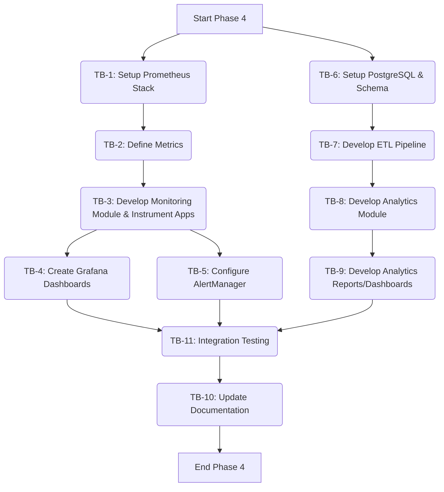

## Plan v1

### Objective
Implement Phase 4 of the airdrop automation system, establishing a robust Monitoring Infrastructure and an insightful Analytics Platform using the Prometheus Stack and a PostgreSQL database, integrated with existing Python-based system components.

### Task Blocks

| ID    | Description                                                                                                | Owner Mode | Deliverable                                                                                                                               | Acceptance Test                                                                                                                                                              | Est. Effort |
| :---- | :--------------------------------------------------------------------------------------------------------- | :--------- | :---------------------------------------------------------------------------------------------------------------------------------------- | :--------------------------------------------------------------------------------------------------------------------------------------------------------------------------- | :---------- |
| **Phase 4.1: Monitoring Infrastructure**                                                                           |            |                                                                                                                                           |                                                                                                                                                                              |             |
| TB-1  | **Setup Prometheus Stack Infrastructure**                                                                  | Code       | Deployed Prometheus, Grafana, AlertManager (e.g., via Docker Compose). Basic configuration files.                                         | Prometheus UI accessible. Grafana accessible. AlertManager UI accessible.                                                                                                    | M           |
| TB-2  | **Define Core System Metrics & Protocol Metrics**                                                          | Architect  | Metrics definition document specifying metrics for Scheduler, Risk Mgmt, Capital Allocation, and key protocol interactions.                 | Document reviewed and approved. Metrics cover key performance, health, and operational aspects.                                                                            | S           |
| TB-3  | **Develop `airdrops.monitoring` Module & Instrument Applications**                                         | Code       | New `airdrops.monitoring` Python module. Instrumented existing modules (`scheduler`, `risk_management`, `capital_allocation`, `protocols`) to expose metrics defined in TB-2 via `prometheus-client`. HTTP endpoint for metrics scraping. | Python unit tests for `airdrops.monitoring` pass. Metrics are exposed on `/metrics` endpoint. Prometheus successfully scrapes metrics from applications. `pytest::monitoring` | L           |
| TB-4  | **Create Initial Grafana Dashboards**                                                                      | Code       | Grafana dashboards for:   1. System Overview (key health & performance indicators)   2. Scheduler Performance   3. Risk Management Status   4. Capital Allocation Efficiency | Dashboards display relevant metrics correctly. Data visualizations are clear and actionable.                                                                               | M           |
| TB-5  | **Configure Basic Alerting Rules in AlertManager**                                                         | Code       | AlertManager configuration with rules for critical system events (e.g., high error rates, scheduler failures, risk threshold breaches). | Alerts are triggered correctly based on defined rules. Notifications are sent to a test channel.                                                                           | S           |
| **Phase 4.2: Analytics Platform**                                                                                  |            |                                                                                                                                           |                                                                                                                                                                              |             |
| TB-6  | **Setup PostgreSQL Database & Design Schema**                                                              | Code       | Deployed PostgreSQL instance. SQL schema definition for storing aggregated metrics, airdrop events, ROI data, portfolio snapshots.        | PostgreSQL accessible. Schema created successfully. Schema supports required analytics queries.                                                                            | S           |
| TB-7  | **Develop ETL Pipeline (Metrics/Logs to PostgreSQL)**                                                      | Code       | Python scripts/service to extract data from Prometheus (via API) and application logs, transform it, and load it into PostgreSQL.         | ETL process runs successfully on a schedule. Data is correctly populated in PostgreSQL tables. `pytest::etl`                                                               | L           |
| TB-8  | **Develop `airdrops.analytics` Module**                                                                    | Code       | New `airdrops.analytics` Python module with functions for:   1. Airdrop event tracking & reporting   2. ROI calculation   3. Portfolio performance analysis | Python unit tests for `airdrops.analytics` pass. Functions produce correct analytical results based on sample data. `pytest::analytics`                                    | L           |
| TB-9  | **Develop Analytics Reports/Dashboards**                                                                   | Code       | Reports/dashboards (potentially in Grafana using PostgreSQL data source, or custom HTML/Python reports) for:   1. Airdrop Claim Success Rate   2. ROI per Protocol/Airdrop   3. Overall Portfolio Value Over Time | Reports/dashboards display accurate analytics. Insights are actionable for strategy refinement.                                                                            | M           |
| **Phase 4.3: Documentation & Integration**                                                                         |            |                                                                                                                                           |                                                                                                                                                                              |             |
| TB-10 | **Update Project Documentation**                                                                           | Architect  | Updated [`docs/pulse_inventory.md`](docs/pulse_inventory.md), [`airdrops/docs/module_deps.dot`](airdrops/docs/module_deps.dot). New documentation for `airdrops.monitoring` and `airdrops.analytics` modules. Operational guide for Phase 4 components. | All documentation reflects new modules and functionalities. Operational guide is clear.                                                                                      | M           |
| TB-11 | **Integration Testing & System Validation**                                                                | Code       | End-to-end tests verifying data flow from metric generation to analytics reports. Validation of alerts and dashboard accuracy.          | Key E2E scenarios pass. Alerts trigger as expected. Dashboard data matches source metrics. Analytics reports are consistent with raw data.                                | M           |

### Flow Diagram

### PCRM Analysis
**Pros:**
*   Comprehensive Observability: Provides deep insights into system health, performance, and financial outcomes.
*   Data-Driven Decisions: Enables optimization of airdrop strategies based on historical performance and ROI.
*   Proactive Issue Detection: Real-time alerting helps in quickly addressing operational problems.
*   Scalable Architecture: Prometheus and PostgreSQL are capable of handling growing data volumes.
*   Industry Standards: Utilizes well-known and robust open-source technologies.

**Cons:**
*   Increased Complexity: Adds new components (Prometheus, Grafana, PostgreSQL, ETL) to the system.
*   Resource Overhead: Monitoring and database systems will consume additional server resources.
*   Initial Setup Effort: Setting up and configuring the new stack requires significant upfront work.
*   Learning Curve: Team may need to learn new tools and concepts (PromQL, Grafana dashboarding, ETL processes).

**Risks:**
*   Metric Overload/Noise: Defining too many or irrelevant metrics can make dashboards and alerts less effective.
    *   Mitigation: Start with a core set of essential metrics (TB-2) and iterate. Regularly review metric utility.
*   Data Inconsistency: Discrepancies between Prometheus data and PostgreSQL data due to ETL issues.
    *   Mitigation: Implement robust validation and reconciliation checks in the ETL pipeline (TB-7). Monitor ETL job success.
*   Alert Fatigue: Poorly configured alerts leading to excessive notifications.
    *   Mitigation: Carefully define alert thresholds and conditions (TB-5). Implement alert grouping and silencing strategies.
*   Scalability Bottlenecks: ETL process or PostgreSQL queries might become slow with large data volumes.
    *   Mitigation: Design efficient ETL processes and database queries (TB-7, TB-8). Monitor performance and optimize as needed. Consider database indexing.
*   Security of New Components: Prometheus, Grafana, PostgreSQL need to be secured.
    *   Mitigation: Follow security best practices for deploying these components (network ACLs, strong credentials, regular updates).