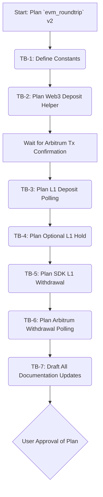

## Plan v2: Hyperliquid `evm_roundtrip()` Function (Fully Automated)

### Objective
To research, define, and plan the documentation for a *fully automated* `evm_roundtrip()` function within the Hyperliquid protocol module. This involves depositing USDC from Arbitrum to Hyperliquid L1 via a direct ERC-20 transfer to the Hyperliquid bridge, polling for L1 credit, initiating an L1 withdrawal back to Arbitrum using the SDK, and polling for withdrawal confirmation on Arbitrum.

### Task Blocks
| ID   | Description                                                                                                                               | Owner Mode | Deliverable                                                                                                                                                              | Acceptance Test                                                                                                                                  | Est. Effort |
|------|-------------------------------------------------------------------------------------------------------------------------------------------|------------|--------------------------------------------------------------------------------------------------------------------------------------------------------------------------|--------------------------------------------------------------------------------------------------------------------------------------------------|-------------|
| TB-1 | **Define & Document Chain/Contract Constants** (Arbitrum Chain ID, USDC address, Hyperliquid Bridge2 address on Arbitrum)                   | Architect  | Constants defined for use in the function and documented in `hyperliquid.md`.                                                                                            | Correct addresses and IDs are documented and readily usable.                                                                                     | Low         |
| TB-2 | **Plan `web3.py` Deposit Helper** (Build, sign, send USDC transfer to Bridge2 on Arbitrum; return tx_hash)                                  | Architect  | Detailed logic for the deposit helper documented for future implementation.                                                                                              | Logic covers transaction construction, signing, sending, and error handling for the Arbitrum USDC transfer.                                      | Medium      |
| TB-3 | **Plan L1 Deposit Confirmation Polling** (Poll `info.user_state()` until L1 balance reflects deposit, or timeout)                           | Architect  | Polling logic (including backoff and timeout) documented.                                                                                                                | Polling strategy is robust and handles success/timeout scenarios.                                                                                | Low         |
| TB-4 | **Plan Optional L1 Hold Logic** (If `hold_seconds` > 0, implement delay)                                                                    | Architect  | Logic for optional hold period documented.                                                                                                                               | Hold logic is correctly integrated.                                                                                                              | Low         |
| TB-5 | **Plan SDK Withdrawal Call** (Call `exchange_agent.withdraw()` to initiate L1 withdrawal to Arbitrum)                                       | Architect  | SDK call details and expected response documented.                                                                                                                       | Correct usage of `exchange.withdraw()` is outlined.                                                                                              | Medium      |
| TB-6 | **Plan Arbitrum Withdrawal Confirmation Polling** (Poll user's USDC balance on Arbitrum via `web3.py` until funds received, or timeout)      | Architect  | Polling logic for Arbitrum USDC balance (including backoff, timeout, and accounting for $1 fee) documented.                                                            | Polling strategy for external chain confirmation is robust.                                                                                      | Medium      |
| TB-7 | **Draft Documentation Updates & Final Plan** (Update `hyperliquid.md`, `airdrops_automation_plan.md`, and this plan document if necessary) | Architect  | Comprehensive diffs for `hyperliquid.md` and `airdrops_automation_plan.md`. This plan document finalized.                                                                | All documentation accurately reflects the fully automated `evm_roundtrip` function, its parameters, logic, and security considerations.        | Medium      |

### Flow Diagram


### Revised `evm_roundtrip()` Signature (for `hyperliquid.md`)
```python
async def evm_roundtrip(
    web3_provider: Web3, # Renamed for clarity, e.g., initialized Web3 instance for Arbitrum
    usdc_contract: Contract, # web3.py Contract instance for USDC on Arbitrum
    wallet_account: LocalAccount, # web3.py LocalAccount for signing Arbitrum transactions
    exchange_agent: hyperliquid.exchange.Exchange,
    info_agent: hyperliquid.info.Info,
    amount_usdc: Decimal, # e.g., Decimal("25.0"), min 5 USDC
    *,
    chain_name: str = "Arbitrum", # Currently fixed to Arbitrum for Bridge2
    arbitrum_chain_id: int = 42161, # For tx signing
    usdc_arbitrum_address: str = "0xaf88d065e77c8cC2239327C5EDb3A432268e5831", # Common USDC on Arbitrum
    hyperliquid_bridge_arbitrum_address: str = "0x2df1c58541F4A5E519B0313f4A4A7A379AC3A78F", # Hyperliquid Bridge2 address
    deposit_confirmation_timeout_seconds: int = 600, # Timeout for Arbitrum tx and L1 crediting
    l1_hold_seconds: int = 0, # Optional hold on L1
    withdrawal_confirmation_timeout_seconds: int = 900 # Timeout for receiving funds back on Arbitrum
) -> dict:
    # Returns: {"status": "success/failure", "message": "...", "deposit_tx_hash": "0x...", "l1_withdrawal_response": {...}, "arbitrum_withdrawal_confirmed_at_balance": Decimal(...)}
    ...
```

### High-Level Logic Flow (for `hyperliquid.md`)
1.  **Prepare Arbitrum Deposit:**
    *   Construct an ERC-20 `transfer` transaction for `amount_usdc` to the `hyperliquid_bridge_arbitrum_address` using `usdc_contract`.
    *   Sign the transaction with `wallet_account`.
    *   Send the raw transaction using `web3_provider.eth.send_raw_transaction()`.
    *   Store the `deposit_tx_hash`.
2.  **Confirm Arbitrum Deposit:**
    *   Wait for at least 1 on-chain confirmation for `deposit_tx_hash` on Arbitrum using `web3_provider.eth.wait_for_transaction_receipt()`.
3.  **Confirm Hyperliquid L1 Credit:**
    *   Poll `info_agent.user_state(user=wallet_account.address)` on Hyperliquid L1.
    *   Check for an increase in the spot USDC balance corresponding to `amount_usdc`.
    *   Use exponential backoff and honor `deposit_confirmation_timeout_seconds`.
4.  **Optional L1 Hold:**
    *   If `l1_hold_seconds` > 0, `await asyncio.sleep(l1_hold_seconds)`.
5.  **Initiate Hyperliquid L1 Withdrawal:**
    *   Call `exchange_agent.withdraw(amount_usd=str(amount_usdc), destination_address=wallet_account.address, chain=chain_name)`.
    *   Store the `l1_withdrawal_response`. Verify `status == "ok"`.
6.  **Confirm Arbitrum Withdrawal Reception:**
    *   Poll `usdc_contract.functions.balanceOf(wallet_account.address).call()` on Arbitrum.
    *   Check for an increase in the USDC balance (approximately `amount_usdc` minus the $1 Hyperliquid withdrawal fee).
    *   Use exponential backoff and honor `withdrawal_confirmation_timeout_seconds`.
7.  **Return Status:**
    *   Compile and return a structured dictionary with the status of each step, relevant transaction hashes, and messages.

### Documentation Update Details (for TB-7)

**A. `airdrops/docs/protocols/hyperliquid.md` Updates:**

1.  **Configuration Section (around line 14):**
    *   Add new constants:
        *   `Arbitrum Chain ID: 42161`
        *   `USDC (Arbitrum) Contract Address: 0xaf88d065e77c8cC2239327C5EDb3A432268e5831`
        *   `Hyperliquid Bridge2 (Arbitrum) Contract Address: 0x2df1c58541F4A5E519B0313f4A4A7A379AC3A78F`
        *   Note: "These are used by the fully automated `evm_roundtrip` function."

2.  **Functions -> `evm_roundtrip()` Section (replace content around lines 90-93):**
    *   **Description:** "Performs a *fully automated* EVM roundtrip action. This involves:
        1.  Sending USDC from the user's wallet on Arbitrum to the Hyperliquid Bridge2 contract via a `web3.py` managed ERC-20 transfer.
        2.  Polling Hyperliquid L1 to confirm the deposit has been credited.
        3.  Optionally holding the funds on L1 for a specified duration.
        4.  Initiating a withdrawal of USDC from Hyperliquid L1 back to the user's Arbitrum wallet address using the SDK's `withdraw` action.
        5.  Polling the user's USDC balance on Arbitrum to confirm receipt of the withdrawn funds (accounting for Hyperliquid's withdrawal fee).
        This function requires pre-configured `web3.py` instances and a `LocalAccount` with an unlocked private key for signing Arbitrum transactions."
    *   **Parameters:** Use the revised signature provided above.
    *   **Returns:** `dict`: A dictionary containing the overall status, messages, and details of each step, e.g., `{"status": "success/failure", "message": "...", "deposit_tx_hash": "0x...", "l1_withdrawal_response": {...}, "arbitrum_withdrawal_confirmed_at_balance": Decimal(...)}`.
    *   **High-Level Internal Logic:** Use the detailed 7-step flow provided above.
    *   **Security Notice:** "This function requires access to a private key for signing transactions on an external EVM chain (Arbitrum). Ensure the private key is managed securely, for example, through environment variables or a dedicated secrets management system. Do not hardcode private keys."

3.  **ABIs/Addresses Section (around line 104, add new entry for `evm_roundtrip`):**
    *   "**For `evm_roundtrip()` (fully automated):**
        *   Utilizes the fixed Arbitrum USDC contract address (`0xaf88d065e77c8cC2239327C5EDb3A432268e5831`) for `transfer` operations. Requires standard ERC-20 ABI.
        *   Utilizes the fixed Hyperliquid Bridge2 contract address on Arbitrum (`0x2df1c58541F4A5E519B0313f4A4A7A379AC3A78F`) as the recipient for USDC deposits.
        *   Hyperliquid L1 interactions (withdrawal, state polling) are managed via the SDK, abstracting L1 addresses."

4.  **RPC Details/API Endpoints Section (around line 116, add new entry for `evm_roundtrip`):**
    *   "**For `evm_roundtrip()` (fully automated):**
        *   Requires an RPC endpoint for the external EVM chain (Arbitrum) to be configured with the `web3.py` provider.
        *   Hyperliquid L1 interactions (`/exchange` for withdrawal, `/info` for state polling) are abstracted by the SDK."

**B. `docs/planning/airdrops_automation_plan.md` Update:**
    *   Read the file to find the "## Phase 2 Progress Log" section.
    *   Add a new dated entry:
        ```
        *   **YYYY-MM-DD:** Re-scoped and planned the `evm_roundtrip()` function for the Hyperliquid module to be *fully automated*.
            *   **Revised Approach:** The function will now manage the entire lifecycle:
                1.  Automated USDC deposit from user's Arbitrum wallet to Hyperliquid Bridge2 via `web3.py` (ERC-20 transfer).
                2.  Confirmation of Arbitrum transaction and L1 crediting via polling.
                3.  Optional L1 hold.
                4.  Automated withdrawal from L1 to user's Arbitrum wallet via Hyperliquid SDK.
                5.  Confirmation of USDC receipt on Arbitrum via `web3.py` polling.
            *   **Key Dependencies:** `web3.py`, `Decimal`, pre-configured `Web3` provider, `LocalAccount` for Arbitrum, and Hyperliquid SDK agents.
            *   **Documentation Plan:** Outlined detailed updates for `airdrops/docs/protocols/hyperliquid.md` reflecting the new signature, logic, required constants (Arbitrum USDC & Bridge2 addresses), and security considerations for private key management.
            *   **Next Steps:** Awaiting approval of this revised plan to proceed with generating documentation diffs.
        ```

### PCRM Analysis (Updated for Plan v2)
*   **Pros:**
    *   Achieves 100% automation for the EVM roundtrip, meeting the core requirement.
    *   Can be scheduled or run programmatically without manual intervention.
    *   Leverages standard `web3.py` for external chain interaction and Hyperliquid SDK for L1.
*   **Cons:**
    *   Introduces a dependency on `web3.py` and requires management of an external EVM private key.
    *   Requires Arbitrum gas for the deposit transaction (though typically low).
    *   Complexity increases due to managing interactions across two chains and two different libraries/APIs.
*   **Risks:**
    *   **Private Key Security:** Improper handling of the Arbitrum private key is a significant security risk. (Mitigation: Emphasize secure storage like `.env` files or KMS in documentation; user is responsible for secure key management).
    *   **Contract/API Changes:** Upgrades to Hyperliquid Bridge2, USDC contract, or SDK APIs could break the flow. (Mitigation: Version pinning where possible, robust error handling, unit/integration tests, monitoring).
    *   **Network Congestion/RPC Issues:** Arbitrum or Hyperliquid API instability can cause timeouts or failures. (Mitigation: Implement robust polling with exponential backoff, configurable timeouts, clear error reporting).
    *   **Gas Price Volatility:** Unexpected spikes in Arbitrum gas prices could make deposits more expensive. (Mitigation: Allow gas price strategy configuration in `web3.py` calls, though the example uses a fixed low gas price).
    *   **Withdrawal Delays/Failures:** Hyperliquid L1 withdrawal processing by validators might be delayed or, in rare cases, fail. (Mitigation: Generous `withdrawal_confirmation_timeout_seconds`, clear logging, potential alerting mechanisms for prolonged issues).
*   **Mitigations:** (Covered above within risks)