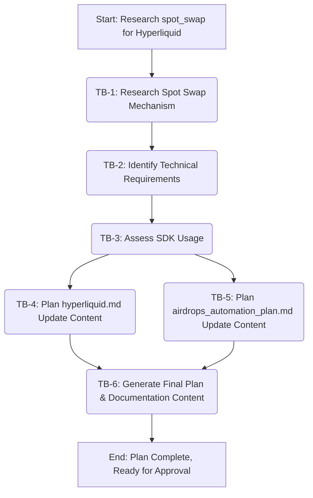

## Plan v1: Hyperliquid `spot_swap` Function

### Objective
To research, plan, and document the implementation details for the `spot_swap(from_token: Any, to_token: Any, amount: Any)` function in the Hyperliquid protocol module, including updating relevant documentation.

### Context Sweep Summary
*   [`docs/pulse_inventory.md`](docs/pulse_inventory.md): Confirms `airdrops.protocols.hyperliquid` module exists and its documentation is at [`airdrops/docs/protocols/hyperliquid.md`](airdrops/docs/protocols/hyperliquid.md).
*   [`airdrops/docs/protocols/hyperliquid.md`](airdrops/docs/protocols/hyperliquid.md): Provides current details on `stake_rotate` and `vault_cycle`, API endpoints, and general SDK usage notes. It has placeholders for `spot_swap`.
*   **MCP `context7` for `hyperliquid-python-sdk`:**
    *   Resolved library ID: `/hyperliquid-dex/hyperliquid-python-sdk`.
    *   SDK documentation snippets retrieved did not explicitly detail a `spot_swap` function but showed examples for basic order placement (`basic_order.py`) and querying user/info state. This suggests spot swaps will likely involve using generic order placement methods within the SDK. The `Exchange.order()` method and `Info.meta()` (for asset ID mapping) appear key.

### Task Blocks

| ID    | Description                                                                                                | Owner Mode   | Deliverable                                                                                                                               | Acceptance Test                                                                                               | Est. Effort |
| :---- | :--------------------------------------------------------------------------------------------------------- | :----------- | :---------------------------------------------------------------------------------------------------------------------------------------- | :------------------------------------------------------------------------------------------------------------ | :---------- |
| TB-1  | **Research Hyperliquid Spot Swap Mechanism**                                                               | Architect    | Detailed understanding of the spot swap process (API vs. on-chain, assets, liquidity, slippage, pricing).                                 | Key information points documented.                                                                            | Medium      |
| TB-2  | **Identify Technical Requirements for `spot_swap`**                                                        | Architect    | Refined Python function signature, API action/payload structure (if SDK abstracts it), necessary API endpoints.                           | Parameters, API/contract details, and endpoints documented.                                                   | Medium      |
| TB-3  | **Assess SDK Usage for `spot_swap`**                                                                       | Architect    | Strategy for using `hyperliquid-python-sdk` v0.15.0 (likely `Exchange.order()` and `Info.meta()`), or outline for direct calls if SDK is insufficient. | Clear decision on SDK usage with justification.                                                               | Medium      |
| TB-4  | **Plan Update for `airdrops/docs/protocols/hyperliquid.md`**                                               | Architect    | Content for updating Configuration, `spot_swap()` function details, ABIs/Addresses, and RPC/API Endpoints sections.                     | Comprehensive content for `spot_swap` sections in [`airdrops/docs/protocols/hyperliquid.md`](airdrops/docs/protocols/hyperliquid.md) drafted. | Medium      |
| TB-5  | **Plan Update for `docs/planning/airdrops_automation_plan.md`**                                            | Architect    | Content for a new dated progress log entry summarizing research, findings, and documentation update plan.                                 | Progress log entry content drafted.                                                                           | Small       |
| TB-6  | **Generate Final Plan & Documentation Content**                                                            | Architect    | This consolidated plan document and the specific text for markdown file updates.                                                          | All deliverables for this planning task are prepared.                                                         | Small       |

### Flow Diagram


### Research Findings & Technical Plan for `spot_swap`

1.  **Spot Swap Functionality Overview:**
    *   **Interaction Method:** Spot swaps on Hyperliquid are expected to be executed via REST API calls to the `/exchange` endpoint. This involves placing an order on a specific spot market pair (e.g., HYPE/USDC). This aligns with Hyperliquid's architecture for other trading functions. Direct on-chain smart contract interaction for this is unlikely.
    *   **Asset Types:** Swappable assets will include those listed on Hyperliquid's spot markets (e.g., HYPE, USDC, other tokens). The definitive list and their market identifiers/asset indices must be fetched via the `/info` API endpoint (e.g., using `info_agent.meta()["universe"]`).
    *   **Liquidity, Slippage, Pricing:**
        *   Liquidity is order-book driven for spot markets.
        *   Pricing is determined by the order book.
        *   Slippage can be managed by using limit orders (setting a `limit_px`). For market orders, slippage is inherent. The API is not expected to have a separate "slippage tolerance" parameter for market orders; this would be handled by the client if desired by adjusting order parameters or through post-trade checks.

2.  **Technical Requirements for Python `spot_swap()` function:**
    *   **Refined Parameters:**
        *   `exchange_agent` (`hyperliquid.exchange.Exchange`): Initialized SDK `Exchange` instance.
        *   `info_agent` (`hyperliquid.info.Info`): Initialized SDK `Info` instance (for fetching asset metadata).
        *   `from_token` (`str`): Symbol of the token to sell (e.g., "HYPE", "USDC"). Case-sensitivity should match Hyperliquid's identifiers.
        *   `to_token` (`str`): Symbol of the token to buy (e.g., "USDC", "PURR").
        *   `amount_from` (`float`): The quantity of `from_token` to sell, in units of the asset itself (e.g., 10.5 for 10.5 HYPE).
        *   `order_type` (`dict`): Specifies the order type and its parameters.
            *   Example (Market Order): `{"market": {}}`
            *   Example (Limit Order): `{"limit": {"tif": "Gtc", "price": "2.55"}}` (price as string)
            *   Other TIF options: `"Alo"` (Add Liquidity Only), `"Ioc"` (Immediate Or Cancel).
    *   **API Interaction (abstracted by SDK):**
        *   Endpoint: `POST https://api.hyperliquid.xyz/exchange`
        *   Action Type: `order`
        *   Payload components: `asset` (integer index of the base asset in the trading pair), `is_buy` (boolean), `sz` (float, size of order in base asset units), `limit_px` (string, price for limit order), `order_type` (dictionary specifying type and TIF).
    *   **Smart Contracts/ABIs:** Not applicable. Interactions are API-based.
    *   **RPC/API Endpoints:**
        *   Primary: `https://api.hyperliquid.xyz/exchange` (for placing orders).
        *   Supporting: `https://api.hyperliquid.xyz/info` (for fetching `meta` including asset details, universe of assets/markets, and asset index mappings).

3.  **SDK Usage (`hyperliquid-python-sdk` v0.15.0):**
    *   The `Exchange.order()` method is the core SDK function to be used. Its signature:
        `order(self, asset: int, is_buy: bool, sz: float, limit_px: str, order_type: OrderType, reduce_only: bool = False, cloid: Optional[str] = None) -> Any:`
    *   **Asset ID Mapping:** The `asset` parameter in `Exchange.order()` requires an integer index.
        *   The `Info.meta()` method (specifically `info_agent.meta()["universe"]`) provides a list of assets, where each asset entry contains its `name` (symbol, e.g., "HYPE") and `id` (the integer index).
        *   The `spot_swap` function will need to:
            1.  Identify the correct trading pair (e.g., HYPE/USDC).
            2.  Determine the base asset of this pair (e.g., HYPE in HYPE/USDC).
            3.  Fetch the integer `id` for this base asset using `info_agent.meta()`.
            4.  Determine the `is_buy` flag. If swapping `from_token` (HYPE) to `to_token` (USDC) on a HYPE/USDC market, this is a sell of HYPE, so `is_buy` would be `False` for the HYPE asset. If swapping USDC to HYPE, it's a buy of HYPE, so `is_buy` would be `True`.
    *   **Amount & Price Formatting:** `sz` is a float. `limit_px` must be a string.
    *   Direct API calls should not be necessary if the SDK's `order` method is sufficient.

### Planned Updates to Documentation

**1. Content for `airdrops/docs/protocols/hyperliquid.md`:**

*   *Under `## Configuration` (add new bullet or integrate):*
    ```markdown
    *   **Spot Market Information:** Spot market details, including available trading pairs, asset names, integer asset indices, and precision, are queryable via the `/info` API endpoint (e.g., using the SDK's `Info.meta()` method).
    ```

*   *Update `### spot_swap()` section entirely:*
    ```markdown
    ### `spot_swap()`
    *   **Description:** Performs a spot swap between two assets on the Hyperliquid platform. This is achieved by placing an order (market or limit) on the relevant spot market pair using the `/exchange` API endpoint. The `hyperliquid-python-sdk` (specifically `Exchange.order()` and `Info.meta()`) is used to facilitate this. For example, swapping HYPE for USDC involves identifying the HYPE/USDC market, determining HYPE as the base asset, and placing a sell order for HYPE.
    *   **Parameters:**
        *   `exchange_agent` (`hyperliquid.exchange.Exchange`): An initialized instance of the SDK's `Exchange` class, handling wallet context and signing.
        *   `info_agent` (`hyperliquid.info.Info`): An initialized instance of the SDK's `Info` class, used to fetch asset metadata like integer IDs.
        *   `from_token` (`str`): The symbol of the asset to be sold (e.g., "HYPE", "USDC"). Must match the naming in `info_agent.meta()["universe"]`.
        *   `to_token` (`str`): The symbol of the asset to be bought (e.g., "USDC", "PURR"). Must match the naming in `info_agent.meta()["universe"]`.
        *   `amount_from` (`float`): The quantity of `from_token` to sell, in units of the `from_token` itself (e.g., if `from_token` is HYPE, 10.5 means 10.5 HYPE tokens).
        *   `order_type` (`dict`): A dictionary specifying the order type and its parameters.
            *   Example (Market Order): `{"market": {}}`
            *   Example (Limit Order, GTC): `{"limit": {"tif": "Gtc", "price": "2.55"}}` (Note: `price` must be a string).
            *   Supported TIF (Time in Force) for limit orders: `"Gtc"`, `"Alo"` (Add Liquidity Only), `"Ioc"` (Immediate Or Cancel).
    *   **Returns:**
        *   `dict`: A dictionary containing the transaction response from Hyperliquid upon successful order placement (typically includes status and details of any filled/resting order). Structure is `{"status": "ok", "response": {"type": "order", "data": {"statuses": [{"resting": {"oid": ...}}, ...]}}}` or similar.
        *   Raises an exception on failure (e.g., API error, insufficient funds).
    *   **High-Level Internal Logic:**
        1.  Use `info_agent.meta()["universe"]` to find the integer asset IDs and other metadata for `from_token` and `to_token`.
        2.  Determine the spot market pair (e.g., if `from_token`="HYPE", `to_token`="USDC", the market might be represented by the base asset "HYPE"). This step requires logic to select the correct market and base asset for the `Exchange.order()` call. For instance, if trading HYPE for USDC, the `asset` for the order call will be the integer ID of HYPE, and `is_buy` will be `False`. If trading USDC for HYPE, `asset` is HYPE's ID, and `is_buy` is `True`. (This assumes markets are defined like HYPE/USDC, where HYPE is the base).
        3.  The `asset_id_for_order` will be the integer ID of `from_token` if `from_token` is the base of the pair, or `to_token` if `to_token` is the base. The `is_buy_for_order` flag will be set accordingly. (This logic needs careful implementation).
            *   *Simpler approach:* Assume `from_token` is always the asset being directly sold or `to_token` is the asset being directly bought in the context of the `Exchange.order` `asset` parameter. For example, to swap HYPE for USDC:
                *   Identify the asset ID for HYPE (let's say `hype_id`).
                *   Call `exchange_agent.order(asset=hype_id, is_buy=False, sz=amount_from, limit_px=..., order_type=...)`. This sells HYPE. The counter asset (USDC) is implied by the market context Hyperliquid maintains for `hype_id` spot trading.
        4.  The `sz` parameter for `exchange_agent.order()` will be `amount_from`.
        5.  The `limit_px` parameter for `exchange_agent.order()` will be extracted from `order_type["limit"]["price"]` if it's a limit order. It must be a string.
        6.  Call `exchange_agent.order(...)` with the determined parameters.
        7.  Return the response from the SDK.
    ```

*   *Under `## ABIs/Addresses` (add new point or ensure clarity):*
    ```markdown
    *   **For `spot_swap()`:** Spot swap operations are executed via signed REST API calls to the `/exchange` endpoint, using an "order" action type. Direct smart contract interaction is not involved. The `hyperliquid-python-sdk` abstracts these API calls.
    ```

*   *Under `## RPC Details/API Endpoints` (add new point or ensure clarity):*
    ```markdown
    *   **For `spot_swap()`:**
        *   `/exchange` (e.g., `https://api.hyperliquid.xyz/exchange`): Used for submitting the spot order via the SDK.
        *   `/info` (e.g., `https://api.hyperliquid.xyz/info`): Used for querying spot market details, asset information (including token names to integer asset ID mappings via `meta()["universe"]`), and potentially order book data.
    ```

**2. Content for `docs/planning/airdrops_automation_plan.md`:**

*   *Append to `## Phase 2 Progress Log`:*
    ```markdown
    ---
    **Date:** 2025-05-28 (Architect Mode)

    **Summary: Research and Planning for Hyperliquid `spot_swap` Function**

    *   **Research Undertaken:**
        *   Reviewed internal project documentation: [`docs/pulse_inventory.md`](docs/pulse_inventory.md), [`airdrops/docs/protocols/hyperliquid.md`](airdrops/docs/protocols/hyperliquid.md).
        *   Utilized `context7` MCP server to query `hyperliquid-python-sdk` (v0.15.0) documentation, focusing on spot trading capabilities.
        *   Analyzed Hyperliquid's API-driven architecture, drawing parallels from existing `stake_rotate` and `vault_cycle` functions.

    *   **Key Findings & Plan for `spot_swap`:**
        *   **Interaction Method:** Spot swaps will be implemented by placing orders on Hyperliquid's spot markets via the `/exchange` REST API endpoint.
        *   **SDK Applicability:** The `hyperliquid-python-sdk` is central. The `Exchange.order()` method will be used to place orders, and `Info.meta()` will be used to fetch asset metadata, particularly mapping token string names (e.g., "HYPE") to the integer asset IDs required by the API.
        *   **Core Parameters Identified:** `exchange_agent`, `info_agent`, `from_token` (str), `to_token` (str), `amount_from` (float), `order_type` (dict for market/limit).
        *   **Asset Identification:** A crucial step will be mapping `from_token` and `to_token` strings to the correct integer asset ID for the `Exchange.order()` call and setting the `is_buy` flag appropriately to represent the desired swap on a specific market pair.
        *   **Liquidity & Slippage:** Handled via standard order book mechanics. Limit orders provide price control (acting as slippage control).
        *   **Return Value:** The SDK's `order` method is expected to return a dictionary with the API response.

    *   **Outstanding Questions / To Be Confirmed During Implementation:**
        *   The precise logic for selecting the `asset` (integer ID) and `is_buy` (boolean) for the `Exchange.order()` call based on `from_token` and `to_token` to correctly represent the trade on the intended spot market pair. (e.g., if swapping A for B, on an A/B market, `asset` is A's ID, `is_buy` is false. If on a B/A market, `asset` is B's ID, `is_buy` is true). This requires understanding how Hyperliquid defines its spot market pairs and which asset is considered the 'base' for the `order` call. The `info_agent.meta()["universe"]` will be key here.
        *   Confirmation of all available spot market pairs and their exact string identifiers if not directly inferable from token names.

    *   **Documentation Update Plan:**
        *   Content has been drafted to update [`airdrops/docs/protocols/hyperliquid.md`](airdrops/docs/protocols/hyperliquid.md) with a comprehensive section for `spot_swap`, including its description, refined parameters, expected SDK usage, return values, and API endpoint details.

    *   **Next Steps:** The Code mode can proceed with implementing the `spot_swap` function based on this research and plan, paying close attention to the asset ID mapping and order construction logic.
    ```

### PCRM Analysis
*   **Pros:**
    *   Provides a clear, actionable plan for implementing the `spot_swap` function.
    *   Leverages the existing `hyperliquid-python-sdk`, minimizing direct API calls.
    *   Integrates with the established documentation structure.
*   **Cons:**
    *   The logic for mapping `from_token`/`to_token` to the SDK's `asset` (int) and `is_buy` (bool) parameters for an order requires careful implementation and understanding of Hyperliquid's market structure via `info.meta()`.
*   **Risks:**
    *   **R1:** Complexity in correctly identifying the market and constructing the `Exchange.order()` parameters (`asset` ID, `is_buy` flag) from `from_token` and `to_token`. (Mitigation: Thoroughly parse `info.meta()["universe"]` during implementation to understand market structures and asset IDs. Test with small, non-critical amounts first.)
    *   **R2:** The `hyperliquid-python-sdk` might have undocumented nuances or limitations for certain spot order types or asset pairs. (Mitigation: Start with common pairs and simple order types like market orders. Refer to any official SDK examples or community resources if issues arise.)
*   **Mitigations:**
    *   **M1 (for R1):** The implementation phase must include robust logic to query `info_agent.meta()` and correctly interpret the `universe` data to map token symbols to integer asset IDs and determine the correct `is_buy` status for the intended swap.
    *   **M2 (for R2):** Incremental development and testing, starting with the most straightforward swaps (e.g., HYPE/USDC market order).