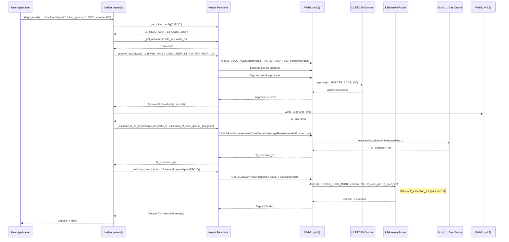

# Scroll Protocol: `bridge_assets` Function Architecture v1

## 1. Overview

This document outlines the architectural design for the `bridge_assets` function, a core component of the Scroll protocol module. This function will facilitate the bridging of ETH and specified ERC20 tokens (WETH, USDC, USDT) between Ethereum (L1) and Scroll (L2).

## 2. Function Signature

```python
def bridge_assets(
    web3_l1: Web3,
    web3_l2: Web3,
    private_key: str,
    direction: str,  # "deposit" or "withdraw"
    token_symbol: str,  # "ETH", "WETH", "USDC", "USDT"
    amount: int,  # Amount in Wei or smallest token unit
    recipient_address: Optional[str] = None
) -> str:
    """
    Bridges assets (ETH or ERC20 tokens) between Ethereum (L1) and Scroll (L2).

    Args:
        web3_l1: Web3 instance for L1 (Ethereum).
        web3_l2: Web3 instance for L2 (Scroll).
        private_key: Private key of the sender's account.
        direction: "deposit" (L1 to L2) or "withdraw" (L2 to L1).
        token_symbol: Symbol of the token to bridge ("ETH", "WETH", "USDC", "USDT").
        amount: Amount of the token to bridge, in Wei or smallest unit.
        recipient_address: Optional. The address to receive the tokens on the destination chain.
                           Defaults to the sender's address if None.

    Returns:
        Transaction hash of the bridging operation.

    Raises:
        ValueError: If an invalid direction or token_symbol is provided.
        InsufficientBalanceError: If the account has an insufficient balance for the transaction.
        TransactionRevertedError: If the bridging transaction is reverted.
        RPCError: If there's an issue communicating with the L1/L2 RPC.
        ApprovalError: If ERC20 approval fails.
        GasEstimationError: If gas estimation fails.
    """
    # Implementation to follow based on the architecture below
    pass
```

## 3. Core Logic

The function will operate based on the `direction` and `token_symbol` parameters.

### 3.1. Deposits (L1 to L2)

The sender's account will be derived from the `private_key`. If `recipient_address` is not provided, it defaults to the sender's address.

#### 3.1.1. ETH Deposit (L1 -> L2)

1.  **Target Contract:** `L1GatewayRouter`
2.  **Function:** `depositETH(address _to, uint256 _amount, uint256 _gasLimit, uint256 _fee)`
    *   `_to`: `recipient_address` on L2.
    *   `_amount`: The `amount` of ETH to deposit (will be `msg.value`).
    *   `_gasLimit`: The gas limit for the L2 transaction execution. This needs to be estimated.
    *   `_fee`: The fee paid to the L1 relayer for processing the L2 transaction. This is the `_gasLimit * L2_gas_price`.
3.  **Transaction Parameters:**
    *   `from`: Sender's L1 address.
    *   `to`: `L1GatewayRouter` address.
    *   `value`: `amount` (ETH being deposited) + `_fee` (calculated L2 execution fee).
    *   `gas`: Estimated gas for the L1 transaction.
    *   `gasPrice`: L1 gas price.
    *   `nonce`: Sender's L1 nonce.
4.  **L2 Gas Estimation:**
    *   The `_gasLimit` for the L2 portion of the `depositETH` call needs to be estimated. This can be a fixed reasonable value initially, or ideally, fetched/estimated via a helper that might involve the `Scroll L1 Gas Oracle` (`0x5300000000000000000000000000000000000000`) or a method provided by Scroll (e.g., `estimateCrossDomainMessageFee` if available on a relevant contract, or a fixed overhead + intrinsic cost).
    *   L2 gas price can be obtained from `web3_l2.eth.gas_price`.

#### 3.1.2. ERC20 Deposit (L1 -> L2)

1.  **Get Token Addresses:** Fetch L1 token address for `token_symbol`.
2.  **Approve `L1GatewayRouter`:**
    *   **Target Contract:** L1 ERC20 Token Contract (e.g., WETH, USDC, USDT on L1).
    *   **Function:** `approve(address spender, uint256 amount)`
        *   `spender`: `L1GatewayRouter` address.
        *   `amount`: The `amount` of ERC20 token to be deposited.
    *   Sign and send this approval transaction on L1. Wait for receipt.
3.  **Deposit ERC20:**
    *   **Target Contract:** `L1GatewayRouter`
    *   **Function:** `depositERC20(address _token, address _to, uint256 _amount, uint256 _gasLimit, uint256 _fee)`
        *   `_token`: L1 address of the ERC20 token.
        *   `_to`: `recipient_address` on L2.
        *   `_amount`: The `amount` of ERC20 token to deposit.
        *   `_gasLimit`: Gas limit for L2 transaction execution (see L2 Gas Estimation above).
        *   `_fee`: Fee for L2 execution (`_gasLimit * L2_gas_price`).
    *   **Transaction Parameters:**
        *   `from`: Sender's L1 address.
        *   `to`: `L1GatewayRouter` address.
        *   `value`: `_fee` (calculated L2 execution fee, paid in ETH).
        *   `gas`: Estimated gas for the L1 transaction.
        *   `gasPrice`: L1 gas price.
        *   `nonce`: Sender's L1 nonce.

### 3.2. Withdrawals (L2 to L1)

The sender's account will be derived from the `private_key`. If `recipient_address` is not provided, it defaults to the sender's address.

#### 3.2.1. ETH Withdrawal (L2 -> L1)

1.  **Target Contract:** `L2GatewayRouter`
2.  **Function:** `withdrawETH(address _to, uint256 _amount, uint256 _gasLimit)`
    *   `_to`: `recipient_address` on L1.
    *   `_amount`: The `amount` of ETH to withdraw (will be `msg.value`).
    *   `_gasLimit`: Gas limit for the L1 transaction execution. This is typically a fixed, reasonably high value for withdrawals, as the L1 execution cost is borne by the user when they finalize the withdrawal on L1 (if applicable to Scroll's design) or is covered by the relayer fee structure. For Scroll, the `_gasLimit` here likely refers to the gas for the L2 part of the transaction, and the L1 finalization cost is separate. The `value` of the transaction should cover the amount being withdrawn.
3.  **Transaction Parameters:**
    *   `from`: Sender's L2 address.
    *   `to`: `L2GatewayRouter` address.
    *   `value`: `amount` (ETH being withdrawn).
    *   `gas`: Estimated gas for the L2 transaction.
    *   `gasPrice`: L2 gas price (can be obtained from `web3_l2.eth.gas_price` or `Scroll L2 Gas Oracle Predeploy: 0x5300000000000000000000000000000000000002`).
    *   `nonce`: Sender's L2 nonce.

#### 3.2.2. ERC20 Withdrawal (L2 -> L1)

1.  **Get Token Addresses:** Fetch L2 token address for `token_symbol`.
2.  **Target Contract:** `L2GatewayRouter`
3.  **Function:** `withdrawERC20(address _token, address _to, uint256 _amount, uint256 _gasLimit)`
    *   `_token`: L2 address of the ERC20 token.
    *   `_to`: `recipient_address` on L1.
    *   `_amount`: The `amount` of ERC20 token to withdraw.
    *   `_gasLimit`: Gas limit for the L2 transaction execution.
4.  **Transaction Parameters:**
    *   `from`: Sender's L2 address.
    *   `to`: `L2GatewayRouter` address.
    *   `value`: `0` (unless the contract requires a fee in ETH for L2 processing, which is unlikely for ERC20 withdrawals where the token itself is transferred).
    *   `gas`: Estimated gas for the L2 transaction.
    *   `gasPrice`: L2 gas price.
    *   `nonce`: Sender's L2 nonce.
    *   **Note:** ERC20 withdrawals from L2 typically do not require a separate approval step for the `L2GatewayRouter` if the router directly pulls tokens via `transferFrom` and the user is the one initiating the call. The `withdrawERC20` function itself handles the token transfer.

## 4. Contract Interaction

*   **ABIs:** Since the `scroll-sdk` directory does not seem to contain ABI JSON files, these will need to be sourced from block explorers (Scrollscan for Scroll L2 contracts, Etherscan for L1 contracts) and stored, likely as JSON files within the project (e.g., in an `abi/scroll/` directory).
*   **Contract Instances:** `web3.eth.contract(address=contract_address, abi=abi_json_content)` will be used to create contract instances.

### Contract Function Mapping:

| Operation        | Token | Direction | Primary Contract   | Function Call                                                                 | `msg.value` (if applicable) |
| ---------------- | ----- | --------- | ------------------ | ----------------------------------------------------------------------------- | --------------------------- |
| Deposit          | ETH   | L1 -> L2  | `L1GatewayRouter`  | `depositETH(address _to, uint256 _amount, uint256 _gasLimit, uint256 _fee)`   | `_amount + _fee`            |
| Deposit          | ERC20 | L1 -> L2  | L1 ERC20 Token     | `approve(address spender, uint256 amount)`                                    | `0`                         |
|                  |       |           | `L1GatewayRouter`  | `depositERC20(address _token, address _to, uint256 _amount, uint256 _gasLimit, uint256 _fee)` | `_fee` (in ETH)             |
| Withdraw         | ETH   | L2 -> L1  | `L2GatewayRouter`  | `withdrawETH(address _to, uint256 _amount, uint256 _gasLimit)`                | `_amount`                   |
| Withdraw         | ERC20 | L2 -> L1  | `L2GatewayRouter`  | `withdrawERC20(address _token, address _to, uint256 _amount, uint256 _gasLimit)`| `0`                         |

**Key Contract Addresses (to be confirmed and stored in config):**

*   **L1ScrollGateway:** `0x6774Bcbd5ceCeF1336b5300fb5186a12DDD8b367`
*   **L2ScrollGateway:** `0x50c7d3e7f7c656493D1D76aaa1a83674592Be171`
*   **L1GatewayRouter:** `0x70911051477C1699782A3871205505115A53b938`
*   **L2GatewayRouter:** `0x2537735209Cb3935A629998596597b89099F4e84`
*   **Scroll L1 Gas Oracle:** `0x5300000000000000000000000000000000000000` (For L1->L2 message fee estimation)
*   **Scroll L2 Gas Oracle Predeploy:** `0x5300000000000000000000000000000000000002` (For L2 gas price information)

**Note on Gateway vs. Router:** The plan specifies `GatewayRouter` contracts for ETH and ERC20. These routers likely abstract interactions with the underlying `ScrollGateway` contracts. We will primarily interact with the `GatewayRouter` contracts as per the plan.

## 5. Configuration Management

*   **Contract Addresses:** Store in a Python configuration file (e.g., `airdrops/src/airdrops/protocols/scroll/config.py`) as constants.
    ```python
    # Example: airdrops/src/airdrops/protocols/scroll/config.py
    SCROLL_L1_GATEWAY_ROUTER_ADDRESS = "0x70911051477C1699782A3871205505115A53b938"
    SCROLL_L2_GATEWAY_ROUTER_ADDRESS = "0x2537735209Cb3935A629998596597b89099F4e84"
    # ... other contract addresses
    ```
*   **ABIs:** Store as JSON files in a dedicated directory, e.g., `airdrops/src/airdrops/protocols/scroll/abi/`.
    *   `L1GatewayRouter.json`
    *   `L2GatewayRouter.json`
    *   `ERC20.json` (standard ABI for approve function)
    *   (Potentially `L1ScrollGateway.json`, `L2ScrollGateway.json` if direct interaction is ever needed, or for gas oracle interfaces if they are contracts)
    A helper function `_load_abi(contract_name: str) -> dict:` can load these.
*   **Token Addresses:** Store in the same configuration file, nested for clarity.
    ```python
    # Example: airdrops/src/airdrops/protocols/scroll/config.py
    TOKEN_ADDRESSES = {
        "ETH": { # ETH is native, no L1/L2 address needed in this structure for ERC20-like handling
            "L1": None, # Or a placeholder like "0xEeeeeEeeeEeEeeEeEeEeeEEEeeeeEeeeeeeeEEeE"
            "L2": None, # Or a placeholder
        },
        "WETH": {
            "L1": "0xC02aaA39b223FE8D0A0e5C4F27eAD9083C756Cc2",
            "L2": "0x5300000000000000000000000000000000000004",
        },
        "USDC": {
            "L1": "0xA0b86991c6218b36c1d19D4a2e9Eb0cE3606eB48",
            "L2": "0x06eFdBFf2a14a7c8E15944D1F4A48F9F95F663A4",
        },
        "USDT": {
            "L1": "0xdAC17F958D2ee523a2206206994597C13D831ec7",
            "L2": "0xf55BEC9cafDbE8730f096Aa55dad6D22d44099Df",
        },
    }
    ```

## 6. Error Handling

Custom exceptions should be defined (e.g., in `airdrops/src/airdrops/protocols/scroll/exceptions.py`) and raised by `bridge_assets` and its helpers.

*   `ValueError`: For invalid `direction`, `token_symbol`.
*   `InsufficientBalanceError(Exception)`: If `web3.eth.get_balance` shows insufficient funds before sending, or if a transaction fails due to this.
*   `TransactionRevertedError(Exception)`: If `web3.eth.wait_for_transaction_receipt` shows `status == 0`. Include receipt details.
*   `RPCError(Exception)`: Catch `requests.exceptions.ConnectionError` or similar from Web3.py for RPC issues.
*   `ApprovalError(TransactionRevertedError)`: Specific error if ERC20 `approve` transaction fails.
*   `GasEstimationError(Exception)`: If gas estimation calls (e.g., `web3.eth.estimate_gas` or oracle calls) fail or return unreasonable values.
*   `MaxRetriesExceededError(Exception)`: If a transaction fails after multiple retries.

The main function should include `try...except` blocks for critical operations like transaction sending and waiting for receipts. Logging should be extensive.

## 7. Helper Functions (Conceptual)

*   `_get_account(private_key: str, web3_instance: Web3) -> Account:`: Returns an `Account` object from `eth_account`.
*   `_get_token_config(token_symbol: str) -> dict:`: Fetches L1/L2 addresses for a given token symbol from the config.
*   `_load_abi(contract_name: str) -> list:`: Loads ABI JSON from the `abi/` directory.
*   `_get_contract(web3_instance: Web3, contract_name: str, contract_address: str = None) -> Contract:`: Loads ABI and returns a contract instance. If `contract_address` is not given, it can fetch from config based on `contract_name`.
*   `_approve_erc20(web3_l1: Web3, private_key: str, token_l1_address: str, spender_address: str, amount: int) -> str:`: Handles the ERC20 approval logic on L1. Returns transaction hash.
*   `_estimate_l1_to_l2_message_fee(web3_l1: Web3, l2_gas_limit: int, l2_gas_price: int = None) -> int:`:
    *   Uses the `Scroll L1 Gas Oracle` (`0x5300000000000000000000000000000000000000`) to get the fee for an L1 to L2 message.
    *   The oracle might have a function like `estimateCrossDomainMessageFee(uint256 gasLimit)` or similar.
    *   If `l2_gas_price` is not provided, it should be fetched from `web3_l2.eth.gas_price`.
    *   This helper will be crucial for calculating the `_fee` parameter for `depositETH` and `depositERC20`.
*   `_build_and_send_tx(web3_instance: Web3, private_key: str, tx_params: dict) -> str:`:
    *   Handles nonce management, gas estimation (if not already provided in `tx_params`), signing, sending, and waiting for receipt.
    *   Implements retry logic for transaction sending.
    *   Raises appropriate errors.

## 8. Sequence Diagram Example: ERC20 Deposit (L1 -> L2)



## 9. Assumptions and Open Questions

*   **ABI Availability:** Assumes standard ABIs for `L1GatewayRouter`, `L2GatewayRouter`, and ERC20 tokens can be obtained from block explorers.
*   **Gas Estimation for L2 Execution (`_gasLimit` for deposits):** The exact mechanism for determining the `_gasLimit` parameter for L2 execution during deposits needs to be robust. While the `Scroll L1 Gas Oracle` is mentioned for fees, it's unclear if it also provides direct L2 execution gas *limit* recommendations or if this needs to be a pre-estimated/fixed value plus a buffer. The `_fee` parameter in `depositETH` and `depositERC20` is `_gasLimit * L2_gas_price`. The `_gasLimit` itself is for the L2 message.
*   **Withdrawal Finalization:** This architecture assumes that withdrawals initiated on L2 are automatically processed and finalized on L1 by Scroll's infrastructure without requiring a second manual transaction from the user on L1. If manual finalization is needed, the `bridge_assets` function for withdrawals would only return the L2 transaction hash, and a separate mechanism/function would be needed to monitor and finalize. The current Scroll bridge typically involves a waiting period and then funds appear.
*   **`scroll-sdk` Utility:** Confirmed that `scroll-sdk` in its current state in the workspace does not provide Python client-side helpers or ABIs for this task.

## 10. Next Steps

1.  **Obtain ABIs:** Fetch and store JSON ABIs for `L1GatewayRouter`, `L2GatewayRouter`, `ERC20` (standard), and potentially the `Scroll L1 Gas Oracle` and `Scroll L2 Gas Oracle Predeploy` if they are contracts with callable view functions for gas price/fee estimation.
2.  **Implement Configuration:** Create `config.py` with contract and token addresses.
3.  **Implement Helper Functions:** Develop the conceptualized helper functions.
4.  **Implement `bridge_assets`:** Build the main function logic, incorporating error handling and retries.
5.  **Testing:** Develop unit and integration tests.