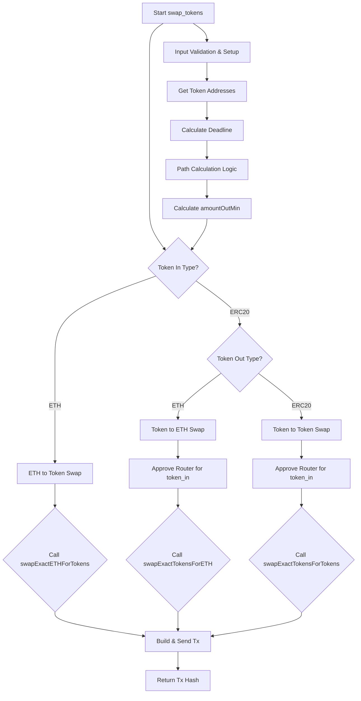

# Scroll `swap_tokens` Function Architecture (SyncSwap) v1

## 1. Overview

This document outlines the architectural design for the `swap_tokens` function within the Scroll protocol module. This function will enable token swaps on the SyncSwap decentralized exchange (DEX) on the Scroll L2 network.

## 2. Function Signature

```python
from web3 import Web3
from typing import Optional

def swap_tokens(
    web3_scroll: Web3,
    private_key: str,
    token_in_symbol: str,
    token_out_symbol: str,
    amount_in: int,
    slippage_percent: float = 0.5,
    deadline_seconds: int = 1800  # 30 minutes
) -> str:
    """
    Swaps tokens on SyncSwap DEX on the Scroll network.

    Args:
        web3_scroll: Web3 instance for Scroll L2.
        private_key: Private key of the account performing the swap.
        token_in_symbol: Symbol of the token to swap from (e.g., "ETH", "USDC").
        token_out_symbol: Symbol of the token to swap to (e.g., "USDC", "WETH").
        amount_in: Amount of token_in to swap (in Wei or smallest unit).
        slippage_percent: Allowed slippage percentage (e.g., 0.5 for 0.5%).
        deadline_seconds: Transaction deadline in seconds from now.

    Returns:
        Transaction hash of the swap operation.

    Raises:
        ScrollSwapError: For general swap-related errors.
        InsufficientLiquidityError: If liquidity is insufficient for the swap.
        SlippageTooHighError: If the actual slippage exceeds the allowed limit (detected post-transaction or if amountOutMin is not met).
        TokenNotSupportedError: If one of the token symbols is not configured.
        ApprovalError: If token approval fails.
        TransactionRevertedError: If the swap transaction is reverted.
        RPCError: For RPC communication issues.
        ... (other relevant exceptions from airdrops.protocols.scroll.exceptions)
    """
    # Implementation to be done by Code mode
    pass
```

## 3. Core Logic

### 3.1. Pre-computation and Setup
1.  **Account Derivation:** Derive the sender's address from `private_key`.
2.  **Token Address Resolution:**
    *   Fetch L2 addresses for `token_in_symbol` and `token_out_symbol` from `SCROLL_TOKEN_ADDRESSES` in `config.py`.
    *   Handle "ETH" specifically, as it might need to be wrapped to WETH for certain SyncSwap pool interactions or use specific ETH-based swap functions. SyncSwap Router often handles ETH directly.
    *   WETH address: `0x5300000000000000000000000000000000000004`
3.  **Deadline Calculation:** Calculate `deadline = current_block_timestamp + deadline_seconds`.

### 3.2. Path Calculation
*   The SyncSwap Router (`0x80e38291e06339d10AAB483C65695D004DBd5C69`) is expected to handle path finding.
*   For `swapExactTokensForTokens` and similar functions, the `path` parameter is an array of token addresses.
    *   For direct swaps (e.g., ETH/USDC), path would be `[token_in_address, token_out_address]`.
    *   If WETH is involved (e.g. ETH to USDC), path might be `[WETH_address, USDC_address]`.
    *   Multi-hop swaps (e.g., TokenA -> WETH -> TokenB) would be `[TokenA_address, WETH_address, TokenB_address]`.
*   Initially, direct paths (TokenA <-> TokenB, ETH/WETH <-> Token) will be prioritized.
*   A helper function `_get_swap_path_syncswap(token_in_address, token_out_address, token_in_symbol, token_out_symbol)` could be conceptualized to construct this path, potentially involving WETH as an intermediary if direct pool doesn't exist, though the router often handles this implicitly if given the start and end tokens. For SyncSwap, the `swapData` parameter in some functions might encode path and pool information. This needs to be verified with the exact ABI and SyncSwap documentation.
    *   **SyncSwap Specifics**: SyncSwap's `swapExactTokensForTokens` typically takes a `path` array: `address[]: An array of token addresses, representing the path for the swap. The first element is the input token, the last is the output token, and any intermediate elements are tokens to route through.`
    *   For ETH swaps, `swapExactETHForTokens` takes `path` which starts with WETH.

### 3.3. Amount Out Min Calculation
*   **Fetch Expected Rate:**
    *   Use the SyncSwap Router's `getAmountsOut` function (or equivalent).
    *   `getAmountsOut(amountIn, path)` returns an array of amounts, where the last element is the expected `amount_out`.
*   **Calculate `amountOutMin`:**
    *   `amountOutMin = expected_amount_out * (1 - slippage_percent / 100)`
    *   Ensure integer arithmetic if dealing with Wei values.
*   A helper function `_calculate_amount_out_min(web3_scroll, router_contract, amount_in, path, slippage_percent)` will handle this.

### 3.4. Swap Execution Flow Diagram



### 3.5. ETH to Token Swap (e.g., ETH -> USDC)
1.  **Path:** `[WETH_address, token_out_address]` (SyncSwap's `swapExactETHForTokens` usually requires path to start with WETH).
2.  **Function:** `swapExactETHForTokens(uint amountOutMin, address[] path, address to, uint deadline)`
    *   `amountOutMin`: Calculated minimum amount of `token_out` to receive.
    *   `path`: Array of token addresses (e.g., `[WETH_SCROLL_ADDRESS, USDC_SCROLL_ADDRESS]`).
    *   `to`: Recipient address (sender's address).
    *   `deadline`: Calculated transaction deadline.
3.  **Transaction:**
    *   `value`: `amount_in` (the amount of ETH being sent).
    *   The transaction will be sent to the SyncSwap Router address.

### 3.6. Token to ETH Swap (e.g., USDC -> ETH)
1.  **Approval:**
    *   Approve the SyncSwap Router to spend `amount_in` of `token_in`.
    *   Use standard ERC20 `approve(spender_address, amount)` function on the `token_in` contract.
    *   Helper function `_approve_erc20(web3_scroll, private_key, token_address, spender_address, amount)` should be used.
2.  **Path:** `[token_in_address, WETH_address]`
3.  **Function:** `swapExactTokensForETH(uint amountIn, uint amountOutMin, address[] path, address to, uint deadline)`
    *   `amountIn`: `amount_in` (amount of `token_in` to swap).
    *   `amountOutMin`: Calculated minimum amount of ETH (WETH) to receive.
    *   `path`: Array of token addresses (e.g., `[USDC_SCROLL_ADDRESS, WETH_SCROLL_ADDRESS]`).
    *   `to`: Recipient address.
    *   `deadline`: Calculated transaction deadline.
4.  **Transaction:** Sent to SyncSwap Router.

### 3.7. Token to Token Swap (e.g., USDC -> USDT)
1.  **Approval:**
    *   Approve the SyncSwap Router to spend `amount_in` of `token_in`.
2.  **Path:** `[token_in_address, token_out_address]` (or `[token_in_address, WETH_address, token_out_address]` if multi-hop via WETH is chosen/required).
3.  **Function:** `swapExactTokensForTokens(uint amountIn, uint amountOutMin, address[] path, address to, uint deadline)`
    *   `amountIn`: `amount_in`.
    *   `amountOutMin`: Calculated minimum amount of `token_out` to receive.
    *   `path`: Array of token addresses.
    *   `to`: Recipient address.
    *   `deadline`: Calculated transaction deadline.
4.  **Transaction:** Sent to SyncSwap Router.

### 3.8. SyncSwap `swapData` Parameter (Alternative)
*   SyncSwap Router might use a `bytes memory swapData` parameter in some functions (e.g., `swap`). This `swapData` encodes the path and pools.
*   If such functions are preferred or necessary, the construction of `swapData` will need to be investigated based on SyncSwap's documentation and examples.
    *   `swapData` typically includes:
        *   `swapSteps`: An array of structs, each defining a step in the swap (pool, tokenIn, tokenOut).
        *   `tokenIn`: Address of the initial input token.
        *   `amountIn`: Amount of the initial input token.
*   For simplicity, using functions like `swapExactETHForTokens`, `swapExactTokensForTokens`, and `swapExactTokensForETH` with explicit `path` arrays is preferred if available and sufficient. This will be confirmed once the ABI is analyzed.

## 4. Contract Interaction (SyncSwap Router)

*   **Router Address (Scroll):** `0x80e38291e06339d10AAB483C65695D004DBd5C69`
*   **ABI:**
    *   The SyncSwap Router ABI is **not currently available** in `airdrops/src/airdrops/protocols/scroll/abi/`.
    *   It needs to be **fetched from Scrollscan (explorer for Scroll) or potentially from SyncSwap's official GitHub/documentation if available for the Scroll deployment.**
    *   Once obtained, it should be saved as `airdrops/src/airdrops/protocols/scroll/abi/SyncSwapRouter.json`.
*   **Key Router Functions (Expected - to be confirmed with ABI):**
    *   `getAmountsOut(uint amountIn, address[] path) view returns (uint[] memory amounts)`: To calculate expected output and `amountOutMin`.
    *   `swapExactETHForTokens(uint amountOutMin, address[] calldata path, address to, uint deadline) payable returns (uint[] memory amounts)`: For ETH to Token swaps.
    *   `swapExactTokensForETH(uint amountIn, uint amountOutMin, address[] calldata path, address to, uint deadline) returns (uint[] memory amounts)`: For Token to ETH swaps.
    *   `swapExactTokensForTokens(uint amountIn, uint amountOutMin, address[] calldata path, address to, uint deadline) returns (uint[] memory amounts)`: For Token to Token swaps.
    *   (Other potential functions: `swapETHForExactTokens`, `swapTokensForExactETH`, `swapTokensForExactTokens`, and generic `swap` functions that might use `swapData`).
*   **Pool Addresses:**
    *   The SyncSwap Router generally abstracts direct interaction with pool addresses for swaps. The `path` parameter in router functions dictates the route through available liquidity pools.
    *   The Classic Pool Factory (`0x3722D347d419D021D51863FA33992A909C2bB296`) is used for creating pools but not typically interacted with directly for swaps via the router.
    *   If direct pool interaction or querying becomes necessary (e.g., for more complex pathfinding or `swapData` construction), the factory could be used to find pool addresses given token pairs. However, this is considered an advanced scenario and not the primary approach.

## 5. Configuration Management

1.  **SyncSwap Router Address:**
    *   Add `SYNC_SWAP_ROUTER_ADDRESS_SCROLL` to `airdrops/src/airdrops/shared/config.py`.
    *   Value: `0x80e38291e06339d10AAB483C65695D004DBd5C69`
2.  **SyncSwap Router ABI:**
    *   Store as `SyncSwapRouter.json` in `airdrops/src/airdrops/protocols/scroll/abi/`.
    *   The `swap_tokens` function will load this ABI to interact with the router.
3.  **Token Addresses:**
    *   Leverage the existing `SCROLL_TOKEN_ADDRESSES` dictionary in `airdrops/src/airdrops/shared/config.py`. This dictionary should map token symbols (e.g., "ETH", "WETH", "USDC", "USDT") to their L2 contract addresses on Scroll.
    *   Ensure all tokens intended for swapping are present:
        *   WETH: `0x5300000000000000000000000000000000000004`
        *   USDC: `0x06eFdBFf2a14a7c8E15944D1F4A48F9F95F663A4`
        *   USDT: `0xf55BEC9cafDbE8730f096Aa55dad6D22d44099Df`
        *   (And any others required)

## 6. Error Handling

The function should utilize custom exceptions defined in `airdrops/src/airdrops/protocols/scroll/exceptions.py` and potentially new ones specific to swaps if needed.

*   **`ScrollSwapError(ScrollError)`:** Base class for swap-specific errors on Scroll.
*   **`InsufficientLiquidityError(ScrollSwapError)`:** Raised if `getAmountsOut` indicates no liquidity or if a swap reverts due to liquidity issues (may require parsing revert reasons).
*   **`SlippageTooHighError(ScrollSwapError)`:**
    *   Can be preemptively checked if `amountOutMin` calculation results in an unacceptably low value compared to a theoretical 1:1 (for stable pairs) or if `getAmountsOut` returns a very poor rate.
    *   More commonly, this is a risk that the transaction executes but at a worse rate than desired, yet still above `amountOutMin`. The current design focuses on `amountOutMin` as the guardrail. True "slippage too high" detection often requires comparing pre-submission quotes with post-execution results, which is complex. The `amountOutMin` parameter is the primary defense against excessive slippage.
*   **`TokenNotSupportedError(ScrollValueError)`:** If `token_in_symbol` or `token_out_symbol` is not found in `SCROLL_TOKEN_ADDRESSES`.
*   **`ApprovalError(ScrollTransactionError)`:** If ERC20 `approve` transaction fails/reverts.
*   **`TransactionRevertedError(ScrollTransactionError)`:** If the main swap transaction reverts. Specific revert reasons from SyncSwap (e.g., "SyncSwap: INSUFFICIENT_OUTPUT_AMOUNT", "SyncSwap: EXPIRED", "TRANSFER_FROM_FAILED") should be logged.
*   **`RPCError`, `GasEstimationError`, `MaxRetriesExceededError`, `TransactionBuildError`, `TransactionSendError`:** As inherited or used from the existing Scroll exception hierarchy.

Error handling should involve:
1.  Clear logging of error details, including token symbols, amounts, and transaction attempts.
2.  Catching specific exceptions from `web3.py` or contract calls and wrapping them in the custom exceptions.
3.  Ensuring that failures in any step (approval, swap) are handled gracefully.

## 7. Helper Functions (Conceptual)

The implementation of `swap_tokens` will likely benefit from these internal helper functions (underscored):

*   `_get_token_address_scroll(token_symbol: str) -> str`: Retrieves L2 token address from config.
*   `_get_syncswap_router_contract(web3_scroll: Web3) -> Contract`: Loads and returns the SyncSwap Router contract instance.
*   `_approve_erc20(web3_scroll: Web3, private_key: str, token_address: str, spender_address: str, amount: int, gas_settings: Optional[dict] = None) -> str`: Handles ERC20 approval logic, including building, signing, sending the transaction, and waiting for receipt.
*   `_calculate_amount_out_min(web3_scroll: Web3, router_contract: Contract, amount_in: int, path: list[str], slippage_percent: float) -> int`: Calculates `amountOutMin` using `getAmountsOut`.
*   `_build_and_send_tx(web3_instance: Web3, contract_function: ContractFunction, private_key: str, tx_params: dict) -> str`: A generic helper (similar to what might exist for `bridge_assets`) to build, sign, send, and wait for a transaction receipt, handling retries and common errors.

## 8. PCRM Analysis (Pros, Cons, Risks, Mitigations)

*   **Pros:**
    *   Enables automated token swapping on Scroll, a key DeFi activity for airdrop farming.
    *   Leverages SyncSwap, a major DEX on Scroll.
    *   Modular design allows for easier testing and maintenance.
*   **Cons:**
    *   Dependent on the stability and availability of SyncSwap contracts and Scroll RPC nodes.
    *   Complexity in handling different swap types (ETH-Token, Token-ETH, Token-Token).
*   **Risks:**
    *   **Smart Contract Bugs:** Bugs in SyncSwap contracts (though audited, risk always exists).
        *   Mitigation: Use official, audited contract addresses. Limit exposure per transaction/wallet.
    *   **ABI Mismatch/Changes:** SyncSwap Router ABI might change or be different from expectations.
        *   Mitigation: Verify ABI from reliable sources (Scrollscan, official SyncSwap channels). Implement versioning or checks if frequent changes are anticipated.
    *   **Insufficient Liquidity:** Pools for desired pairs might have low liquidity, leading to failed swaps or high slippage.
        *   Mitigation: `_calculate_amount_out_min` helps. Consider adding pre-swap liquidity checks if `getAmountsOut` is insufficient. Log and potentially retry or alert.
    *   **High Gas Fees on Scroll:** Network congestion can lead to high gas fees.
        *   Mitigation: Implement configurable gas price strategies. Allow user to set gas limits.
    *   **Front-running/Slippage:** Transactions can be front-run, or price can move leading to slippage.
        *   Mitigation: Use `amountOutMin` effectively. Keep `deadline_seconds` reasonably short. Consider private RPCs if front-running becomes a major issue (advanced).
    *   **Token Approval Exploits:** If approval logic is flawed (e.g., infinite approval to a compromised router - though SyncSwap router is standard).
        *   Mitigation: Approve only the necessary `amount_in` for each transaction, or use EIP-2612 permits if SyncSwap supports them (unlikely for router, more for direct pool interactions). Current design implies per-transaction approval amount.
*   **Mitigations (General):**
    *   Thorough unit and integration testing.
    *   Comprehensive logging for easier debugging.
    *   Configurable parameters (slippage, deadline, gas).
    *   Robust error handling and retry mechanisms.

## 9. External References
*   SyncSwap Documentation: (URL to be added once found for Scroll-specific interactions)
*   Scrollscan (for contract addresses, ABIs, transactions): https://scrollscan.com/
*   SyncSwap Router on Scroll: [`0x80e38291e06339d10AAB483C65695D004DBd5C69`](https://scrollscan.com/address/0x80e38291e06339d10AAB483C65695D004DBd5C69)
*   Scroll Token Addresses (examples):
    *   WETH: [`0x5300000000000000000000000000000000000004`](https://scrollscan.com/address/0x5300000000000000000000000000000000000004)
    *   USDC: [`0x06eFdBFf2a14a7c8E15944D1F4A48F9F95F663A4`](https://scrollscan.com/address/0x06eFdBFf2a14a7c8E15944D1F4A48F9F95F663A4)
    *   USDT: [`0xf55BEC9cafDbE8730f096Aa55dad6D22d44099Df`](https://scrollscan.com/address/0xf55BEC9cafDbE8730f096Aa55dad6D22d44099Df)

This document provides the architectural blueprint. The next step is implementation by the Code mode, which will include fetching the SyncSwap Router ABI and writing the Python code.