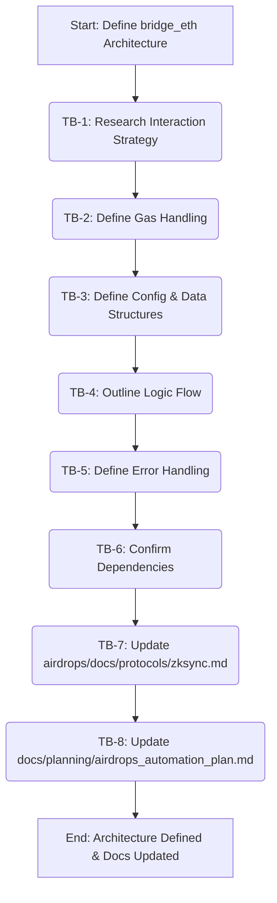

## Plan v1

### Objective
Define the technical architecture for the `bridge_eth` function, which handles ETH bridging (deposit L1->L2 and withdrawal initiation L2->L1) for the zkSync Era protocol module, and update relevant project documentation.

### Task Blocks
| ID   | Description                                                                 | Owner Mode   | Deliverable                                                                                                | Acceptance Test                                                                                                                              |
|------|-----------------------------------------------------------------------------|--------------|------------------------------------------------------------------------------------------------------------|----------------------------------------------------------------------------------------------------------------------------------------------|
| TB-1 | Research & Document zkSync Bridge Interaction Strategy                      | Architect    | Documented L1/L2 contract addresses, key function names (deposit/withdraw), and parameters.                | Document in [`airdrops/docs/protocols/zksync.md`](airdrops/docs/protocols/zksync.md:1) contains L1/L2 bridge addresses, function names, and main parameters.             |
| TB-2 | Define Transaction Parameters & Gas Handling                                | Architect    | Documented strategy for L1/L2 gas, `msg.value` for deposits, and zkSync-specific gas for withdrawals.      | Document details L1 gas estimation, `msg.value` construction, and L2 gas parameter handling.                                                 |
| TB-3 | Define Data Structures & Configuration (`config` dictionary)                | Architect    | Documented `config` structure for RPC URLs, contract addresses, Chain IDs, and ABI storage/retrieval.      | Document clearly defines `config` keys and their purpose.                                                                                    |
| TB-4 | Outline `bridge_eth` Function Logic Flow                                    | Architect    | Documented step-by-step logic for L1->L2 deposits and L2->L1 withdrawal initiation.                        | Document provides clear, sequential steps for both operations, including `web3` setup, contract calls, and receipt checking.                 |
| TB-5 | Define Error Handling Strategy for `bridge_eth`                             | Architect    | Documented common error scenarios (e.g., insufficient balance, RPC errors) and handling approaches.        | Document lists common bridge operation errors and suggests handling strategies.                                                              |
| TB-6 | Confirm Dependencies for zkSync Interaction                                 | Architect    | Documented primary dependencies (e.g., `web3.py`) and any specific version notes or helper libraries.      | Document confirms `web3.py` and notes any other recommendations.                                                                             |
| TB-7 | Update Protocol Documentation ([`airdrops/docs/protocols/zksync.md`](airdrops/docs/protocols/zksync.md:1))         | Architect    | Updated protocol documentation file with all architectural decisions from TB-1 to TB-6.                        | Markdown file contains comprehensive details for `bridge_eth` function.                                                                      |
| TB-8 | Update Project Progress Log ([`docs/planning/airdrops_automation_plan.md`](docs/planning/airdrops_automation_plan.md:1)) | Architect    | Updated main planning document with a new progress log entry for zkSync Era `bridge_eth` architecture.       | Planning document has a new, correctly timestamped entry in the "zkSync Era - Progress Log" section.                                       |

### Flow Diagram

### PCRM Analysis
*   **Pros:**
    *   Provides a clear architectural blueprint for the `bridge_eth` function, guiding subsequent implementation by Code mode.
    *   Leverages `web3.py`, aligning with existing project dependencies and patterns (e.g., LayerZero module).
    *   Proactively addresses key considerations such as configuration, gas management, logic flow, and error handling.
*   **Cons:**
    *   The plan relies on contract addresses and some high-level details from the existing [`docs/planning/airdrops_automation_plan.md`](docs/planning/airdrops_automation_plan.md:1). These should be cross-verified with official zkSync Era documentation during implementation.
    *   Exact ABIs and comprehensive function signatures for the zkSync Era bridge contracts are not fully detailed by this plan and will need to be sourced or confirmed during implementation.
*   **Risks:**
    *   **Contract Detail Mismatch:** Official zkSync Era bridge contract addresses, ABIs, or function signatures might differ from those in the project plan or assumed here.
        *   *Mitigation:* The implementation phase (Code mode) must begin by verifying all contract details against the latest official zkSync Era documentation.
    *   **Gas Mechanism Complexity:** zkSync Era's L2 gas mechanism (including `gasPerPubdataByteLimit` and L1 interaction costs) might be more complex than initially estimated.
        *   *Mitigation:* Allocate specific time during implementation for thorough testing and refinement of gas estimation and transaction parameter settings, especially on a testnet.
    *   **EIP-712 Handling:** If zkSync Era requires EIP-712 signed transactions for bridge interactions and `web3.py` does not transparently handle this, custom signing logic might be needed.
        *   *Mitigation:* During implementation, if standard `web3.py` transaction signing methods prove insufficient, investigate and implement EIP-712 signing, potentially referencing zkSync's JS SDK for patterns if no direct Python equivalent is readily available.
*   **Mitigations (General):**
    *   The generated documentation ([`airdrops/docs/protocols/zksync.md`](airdrops/docs/protocols/zksync.md:1)) will clearly state that ABIs and exact function signatures are to be confirmed by Code mode.
    *   The design will emphasize robust error handling and detailed logging to aid in debugging.
    *   Strongly recommend thorough testing on the zkSync Era testnet before any mainnet deployment.