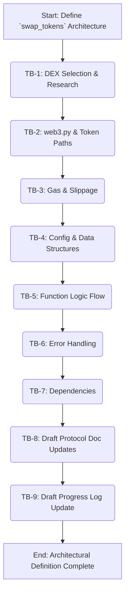

## Plan v1

### Objective
To conduct detailed research and define the technical architecture for the `swap_tokens` function within the zkSync Era module, focusing on SyncSwap for initial DEX integration, and to prepare the necessary updates for project documentation.

### Task Blocks

| ID   | Description                                                                 | Owner Mode | Deliverable                                                                                                                               | Acceptance Test                                                                                               |
|------|-----------------------------------------------------------------------------|------------|-------------------------------------------------------------------------------------------------------------------------------------------|---------------------------------------------------------------------------------------------------------------|
| TB-1 | **DEX Selection & Initial Research**                                        | Architect  | Chosen primary DEX (SyncSwap) with rationale. SyncSwap Router contract address and key function signatures for swaps (e.g., `swapExactTokensForTokens`). | DEX selected and justified. Router address and relevant function names identified and documented.             |
| TB-2 | **`web3.py` Interaction Strategy & Token Paths**                            | Architect  | Detailed strategy for `web3.py` interaction with SyncSwap router. Approach for determining token paths (e.g., direct, via WETH).           | Clear explanation of `web3.py` usage for swap calls. Token pathing strategy defined.                        |
| TB-3 | **Transaction Parameters: Gas & Slippage Handling**                         | Architect  | Strategy for handling zkSync Era specific gas parameters. Method for incorporating `slippage_bps` (e.g., calculating `amountOutMin`).       | zkSync Era gas handling for swaps detailed. Slippage calculation and application method defined.              |
| TB-4 | **Configuration & Data Structures Definition**                              | Architect  | Definition of `config` dictionary additions for `swap_tokens` (RPC, DEX Router, ABIs, WETH address, token list). Any internal data structures. | `config` elements for `swap_tokens` clearly defined and documented.                                           |
| TB-5 | **Function Logic Flow Design**                                              | Architect  | Step-by-step logic for `swap_tokens`: input validation, `web3` L2 setup, token approval, swap transaction construction, sending, receipt checking, ETH handling. | Comprehensive logic flow documented, covering all necessary steps including ETH wrapping/unwrapping.        |
| TB-6 | **Error Handling Strategy**                                                 | Architect  | Outline of common DEX swap error scenarios (e.g., insufficient liquidity, high slippage, reverts) and proposed handling strategies.       | Key error scenarios identified with robust handling strategies proposed for each.                             |
| TB-7 | **Dependency Confirmation**                                                 | Architect  | Confirmation of `web3.py` as the primary dependency for interactions.                                                                     | Dependencies confirmed and documented.                                                                        |
| TB-8 | **Draft Documentation: Protocol Doc Update**                                | Architect  | Drafted content for updating [`airdrops/docs/protocols/zksync.md`](airdrops/docs/protocols/zksync.md:1) (sections 2, 3.2, 4, 5).                 | All architectural decisions from TB-1 to TB-7 are incorporated into draft content for the protocol document. |
| TB-9 | **Draft Documentation: Project Progress Log Update**                        | Architect  | Drafted log entry for [`docs/planning/airdrops_automation_plan.md`](docs/planning/airdrops_automation_plan.md:1).                                        | Progress log entry drafted with correct format, timestamp placeholder, and chosen DEX.                      |

### Flow Diagram

### PCRM Analysis
*   **Pros:**
    *   Provides a structured approach to a complex function design.
    *   Focuses on a prominent DEX (SyncSwap) for practical initial implementation.
    *   Ensures all critical aspects (gas, slippage, errors, config) are considered.
    *   Prepares documentation updates concurrently with design.
*   **Cons:**
    *   Initial research for DEX specifics (contract addresses, exact ABI details if not standard) might require more time than estimated if information is not readily available.
    *   zkSync Era's evolving nature might mean some details (e.g., gas handling specifics) could change.
*   **Risks:**
    *   **Outdated DEX Information:** DEX contract addresses or ABIs might change.
        *   *Mitigation:* Verify information from official DEX documentation and block explorers at the time of detailed design. State assumptions clearly.
    *   **Complex Gas Mechanics:** zkSync Era gas calculations can be intricate.
        *   *Mitigation:* Refer to latest official zkSync documentation and leverage existing patterns from `bridge_eth` if applicable.
    *   **Unsupported Swap Paths:** The chosen DEX might not support all arbitrary token pairs directly.
        *   *Mitigation:* Design token path logic to include common intermediaries like WETH.
*   **Mitigations:** (Covered above)