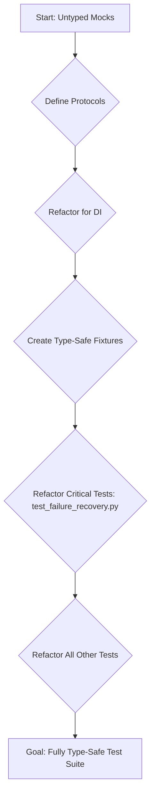

# Plan v1: Type-Safe Mocking Architecture

### Objective
To design and implement a new, type-safe testing and mocking architecture that is fully compatible with `mypy --strict`, resolving the fundamental conflict between the current mocking strategy and type-safety requirements.

---

## 1. Problem Analysis

The current testing architecture relies heavily on `unittest.mock.Mock` and `unittest.mock.MagicMock` without type-preserving specifications. This creates mock objects of type `Any`, which subverts `mypy`'s static analysis and leads to a cascade of type errors.

**Key Issues:**
- **Untyped Mocks:** Mocks are created without `spec` or `spec_set`, so they lack the interface of the real objects they replace.
- **Attribute Errors:** `mypy` correctly flags attribute access on mocks because it cannot verify that the attributes exist.
- **Fragile Patching:** Runtime patching of modules and classes without proper type information makes tests difficult to maintain and reason about.
- **Inconsistent Strategies:** While a `MockWallet` framework exists, its principles are not applied globally to other components like protocol clients, managers, or utility classes.

---

## 2. Proposed Architecture: Interface-Driven & Spec-Preserving Mocks

The new architecture is founded on two principles: defining clear contracts (interfaces) and ensuring mocks adhere to those contracts.

### 2.1. Core Strategy: `typing.Protocol` for Interfaces

We will define explicit interfaces for our core components using `typing.Protocol`. A `Protocol` defines the methods and attributes an object must have to be considered a "duck type" equivalent. This allows for a clean separation between the concrete implementation and its use, which is ideal for dependency injection and mocking.

**Example: Defining a Protocol for a Protocol Client**

```python
# in airdrops/protocols/scroll/interfaces.py
from typing import Protocol, Dict, Any
from web3.types import TxReceipt

class IScrollProtocol(Protocol):
    """
    Defines the interface for the Scroll protocol client.
    """
    def swap_tokens(self, wallet_address: str, amount: int) -> TxReceipt:
        ...

    def bridge_assets(self, wallet_address: str, amount: int) -> TxReceipt:
        ...
```

### 2.2. Mocking Techniques

We will employ two primary techniques for creating type-safe mocks, chosen based on the complexity of the object being mocked.

#### Technique A: `unittest.mock.create_autospec`

For most cases, `unittest.mock.create_autospec` (or `Mock(spec=...)`) is sufficient. It creates a mock object that strictly conforms to the interface of the provided class or `Protocol`. Any attempt to access a non-existent attribute or call a method with the wrong signature will raise an `AttributeError`, both at runtime and during static analysis with `mypy`.

**Before (Current Problem):**
```python
# in tests/protocols/test_scroll.py
from unittest.mock import Mock

def test_some_scroll_feature():
    mock_scroll_client = Mock()
    mock_scroll_client.swap_tokens.return_value = {"status": 1} # mypy error: "Mock" has no attribute "swap_tokens"

    # ... test logic ...
```

**After (New Architecture):**
```python
# in tests/protocols/test_scroll.py
from unittest.mock import create_autospec
from airdrops.protocols.scroll.interfaces import IScrollProtocol
from airdrops.protocols.scroll.scroll import ScrollProtocol

def test_some_scroll_feature():
    # The mock is created from the real class or the Protocol
    mock_scroll_client = create_autospec(IScrollProtocol, instance=True)
    mock_scroll_client.swap_tokens.return_value = {"status": 1} # OK! mypy knows this method exists.

    # This would fail static analysis and raise an error at runtime:
    # mock_scroll_client.non_existent_method() # AttributeError

    # ... test logic ...
```

#### Technique B: Custom Mock Classes

For complex components with internal state or intricate logic, a dedicated mock class that implements the `Protocol` is a more robust solution. This approach is already used in `docs/mocks.md` for wallets and should be expanded.

**Example: A Custom Mock for `IScrollProtocol`**

```python
# in tests/mocks/protocols.py
from typing import Dict, Any
from web3.types import TxReceipt
from airdrops.protocols.scroll.interfaces import IScrollProtocol

class MockScrollProtocol(IScrollProtocol):
    """A stateful, type-safe mock for the Scroll protocol client."""
    def __init__(self):
        self.call_history = []
        self.should_fail = False

    def swap_tokens(self, wallet_address: str, amount: int) -> TxReceipt:
        self.call_history.append(("swap_tokens", wallet_address, amount))
        if self.should_fail:
            raise Exception("Simulated swap failure")
        return {"status": 1, "transactionHash": b'0x...'}

    def bridge_assets(self, wallet_address: str, amount: int) -> TxReceipt:
        self.call_history.append(("bridge_assets", wallet_address, amount))
        if self.should_fail:
            raise Exception("Simulated bridge failure")
        return {"status": 1, "transactionHash": b'0x...'}
```

### 2.3. Fixture Redesign with `pytest`

`pytest` fixtures are the ideal mechanism for providing these type-safe mocks to our tests. We will create a set of fixtures in `conftest.py` and specialized test files to handle mock creation and injection.

**Before (Current Problem):**
```python
# in tests/test_failure_recovery.py
@patch("airdrops.protocols.scroll.scroll.swap_tokens")
def test_something(mock_scroll_swap):
    mock_scroll_swap.side_effect = Exception("...")
    # ...
```

**After (New Architecture):**
```python
# in tests/conftest.py or relevant test file
import pytest
from unittest.mock import Mock
from tests.mocks.protocols import MockScrollProtocol
from airdrops.protocols.scroll.interfaces import IScrollProtocol

@pytest.fixture
def mock_scroll_client() -> Mock: # Type hint as Mock for flexibility
    """Provides a type-safe mock of the IScrollProtocol."""
    # Can return either a custom mock or an autospecced one
    return create_autospec(IScrollProtocol, instance=True)

# in tests/some_test.py
def test_something(mock_scroll_client: Mock): # Fixture is injected
    mock_scroll_client.swap_tokens.side_effect = Exception("...")
    # ...
```

### 2.4. Dependency Injection

To make this all work, our application code must be structured to allow dependencies to be injected. Constructor injection is the preferred pattern.

**Before (Hard-coded dependency):**
```python
from airdrops.protocols.scroll.scroll import ScrollProtocol

class SomeManager:
    def __init__(self):
        self.scroll_client = ScrollProtocol() # Hard to mock

    def do_something(self):
        self.scroll_client.swap_tokens(...)
```

**After (Dependency Injection):**
```python
from typing import Optional
from airdrops.protocols.scroll.interfaces import IScrollProtocol
from airdrops.protocols.scroll.scroll import ScrollProtocol

class SomeManager:
    def __init__(self, scroll_client: Optional[IScrollProtocol] = None):
        self.scroll_client: IScrollProtocol = scroll_client or ScrollProtocol() # Injectable

    def do_something(self):
        self.scroll_client.swap_tokens(...)

# In production code:
manager = SomeManager() # Uses real client

# In test code:
mock_client = create_autospec(IScrollProtocol)
manager = SomeManager(scroll_client=mock_client) # Injects mock
```

---

## 3. Phased Implementation Plan

This will be a multi-sprint effort to refactor the codebase without halting other development.

### Sprint 1: Foundation & Core Protocols (1-2 weeks)

*   **TB-1: Create `interfaces` modules.**
    *   **Description:** Create a new `interfaces.py` file within each major component directory (e.g., `src/airdrops/protocols/scroll/interfaces.py`, `src/airdrops/risk_management/interfaces.py`).
    *   **Owner Mode:** Code
    *   **Deliverable:** Python files containing `Protocol` definitions for the main classes in each component.
    *   **Acceptance Test:** `mypy` passes on the new interface modules.
*   **TB-2: Refactor Core Components for Dependency Injection.**
    *   **Description:** Modify the `__init__` methods of key managers (`RiskManager`, `CapitalAllocator`, `AirdropSchedulerBot`) to accept protocol clients and other dependencies as optional arguments.
    *   **Owner Mode:** Code
    *   **Deliverable:** Updated Python classes that use constructor injection.
    *   **Acceptance Test:** Existing tests still pass. `mypy` passes on the refactored classes.
*   **TB-3: Refactor `tests/protocols/test_scroll.py` and `test_zksync.py`.**
    *   **Description:** Update these two key test files to use the new type-safe mocking strategy. Create `pytest` fixtures that provide specced mocks of the `IScrollProtocol` and `IZkSyncProtocol`.
    *   **Owner Mode:** Code
    *   **Deliverable:** A fully refactored, `mypy`-compliant test file.
    *   **Acceptance Test:** All tests in the file pass. `mypy --strict` reports zero errors for this file.

### Sprint 2: Systemic Test Refactoring (2-3 weeks)

*   **TB-4: Refactor `tests/test_failure_recovery.py`.**
    *   **Description:** This is a major undertaking. Systematically replace all untyped `Mock` and `patch` calls with specced mocks and dependency-injected fixtures for components like `ConnectionManager`, `StateManager`, `GasManager`, etc.
    *   **Owner Mode:** Code
    *   **Deliverable:** A fully refactored, `mypy`-compliant `test_failure_recovery.py`.
    *   **Acceptance Test:** All tests pass. `mypy --strict` reports zero errors for this file.
*   **TB-5: Refactor `tests/test_end_to_end.py`.**
    *   **Description:** Similar to TB-4, refactor the end-to-end tests to use the new fixture-based mocking approach.
    *   **Owner Mode:** Code
    *   **Deliverable:** A fully refactored, `mypy`-compliant `test_end_to_end.py`.
    *   **Acceptance Test:** All tests pass. `mypy --strict` reports zero errors for this file.
*   **TB-6: Create a `tests/mocks` directory and populate it.**
    *   **Description:** Formalize the creation of custom mock classes. Create a `tests/mocks/protocols.py`, `tests/mocks/managers.py`, etc. Move the existing `MockWallet` framework into this structure.
    *   **Owner Mode:** Code
    *   **Deliverable:** A well-organized directory of reusable, type-safe mock classes.
    *   **Acceptance Test:** Mocks are used successfully in refactored tests.

### Sprint 3: Finalization & Documentation (1 week)

*   **TB-7: Sweep remaining test files.**
    *   **Description:** Audit and refactor any remaining test files that use the old mocking patterns.
    *   **Owner Mode:** Code
    *   **Deliverable:** A fully `mypy`-compliant `tests/` directory.
    *   **Acceptance Test:** The entire project passes `mypy --strict` with zero errors related to mocking.
*   **TB-8: Update project documentation.**
    *   **Description:** Update `docs/mocks.md` and any other relevant development guides to reflect the new architecture. Add a section on "How to Write Type-Safe Tests."
    *   **Owner Mode:** Architect
    *   **Deliverable:** Updated markdown documentation.
    *   **Acceptance Test:** Documentation accurately reflects the new patterns.

---

## 4. Flow Diagram



---

## 5. PCRM Analysis

*   **Pros:**
    *   **Type Safety:** Eliminates an entire class of bugs and improves developer confidence.
    *   **Maintainability:** Tests become more readable, explicit, and less prone to breaking from unrelated changes.
    *   **Better IDE Support:** Autocompletion and static analysis will work on mock objects.
*   **Cons:**
    *   **Initial Effort:** The refactoring requires a significant upfront time investment.
    *   **Increased Boilerplate:** Defining protocols and custom mocks can be more verbose than using `MagicMock`.
*   **Risks:**
    *   **Incomplete Refactoring:** If the refactoring is not completed, we will be left with two competing, incompatible testing patterns.
    *   **Complex Mocks:** Some components may be very difficult to mock, requiring significant effort to create a faithful, type-safe replacement.
*   **Mitigations:**
    *   **Phased Rollout:** The sprint-based plan ensures incremental progress and allows the team to learn the new patterns gradually.
    *   **Prioritization:** We are tackling the most problematic files first to maximize impact.
    *   **Clear Documentation:** The final documentation will serve as a guide to prevent backsliding into old patterns.

---

## Next Step
This plan provides a comprehensive roadmap to resolving our core testing issues. The proposed architecture will enhance stability, maintainability, and developer productivity.