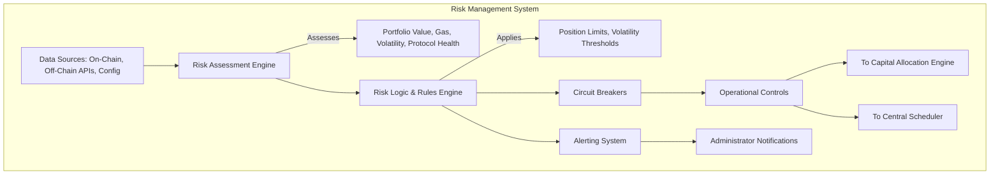
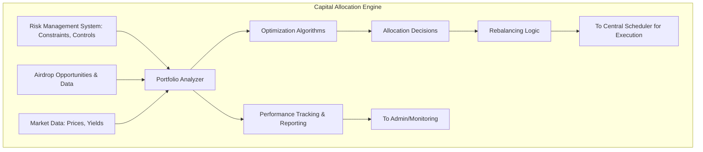

# Phase 3 Airdrops Automation: Formalized Plan

**Document Version:** 1.0
**Date:** 2025-06-02
**Status:** Proposed

## 1. Overview

This document outlines the formalized plan for Phase 3 of the Airdrops Automation project. The core strategy is a **Safety-First Modular Implementation**, prioritizing robust risk management before deploying capital or complex scheduling logic. This approach aims to build a resilient, extensible, and maintainable system for automated airdrop participation.

Phase 3 will focus on developing three key components:
1.  **Risk Management System**: To monitor and control operational risks.
2.  **Capital Allocation Engine**: To optimize capital deployment based on risk and reward.
3.  **Central Scheduler**: To orchestrate airdrop tasks efficiently and reliably.

These components will be implemented in the order listed above to ensure that safety mechanisms are in place before any automated actions involving capital are performed.

## 2. Core Components

The system is designed with a modular architecture. Each component will be developed and tested independently before integration.

### 2.1. Risk Management System (Implementation Priority: 1) - **IN PROGRESS**

**Objective**: To establish a comprehensive framework for identifying, assessing, monitoring, and mitigating risks associated with automated airdrop farming activities. This system is the foundational safety layer.

**Architecture**: A multi-layered system providing real-time risk assessment, configurable control parameters, and emergency stop capabilities.

**Implementation Status**:
- ✅ **COMPLETED**: Core module structure created (`airdrops/src/airdrops/risk_management/`)
- ✅ **COMPLETED**: RiskManager class implemented with initial risk assessment features
- ✅ **COMPLETED**: Position monitoring, gas cost tracking, and market volatility assessment methods
- ✅ **COMPLETED**: Comprehensive test suite with 100% coverage
- ✅ **COMPLETED**: Documentation and integration with project inventory
- 🔄 **IN PROGRESS**: Real-time risk assessment implementation

**Key Features & Technical Specifications**:

*   **Real-time Assessment & Monitoring**:
    *   **Data Sources**:
        *   On-chain: Wallet balances, transaction statuses, smart contract states, gas prices (e.g., via Web3 provider).
        *   Off-chain: Market data APIs for asset prices, volatility indices, protocol-specific news/alerts.
    *   **Monitored Metrics**:
        *   Overall portfolio value and P&L.
        *   Exposure per protocol, per asset, and per transaction.
        *   Real-time gas price feeds and historical trends.
        *   Protocol-specific health indicators (e.g., TVL changes, security alerts).
        *   System anomalies (e.g., high transaction failure rates).
*   **Position & Exposure Limits**:
    *   **Protocol Limit**: Maximum percentage of total capital allocated to any single protocol (e.g., 20%).
    *   **Transaction Limit**: Maximum percentage of total capital used in a single transaction (e.g., 5%).
    *   **Asset Concentration Limit**: Maximum exposure to a single crypto-asset.
    *   These limits will be configurable and dynamically adjustable.
*   **Volatility Monitoring**:
    *   **Metric**: Develop or integrate a VIX-style volatility index tailored for relevant crypto markets/assets.
    *   **Thresholds**: Define multiple volatility states (e.g., Low, Medium, High, Extreme).
    *   **Actions**: Higher volatility states could trigger reduced activity, smaller transaction sizes, or temporary suspension of new operations.
*   **Gas Price Management**:
    *   Monitor current and historical gas prices.
    *   Set thresholds for acceptable gas prices for different types of transactions.
    *   Delay or reschedule non-critical transactions if gas prices exceed thresholds.
*   **Circuit Breakers & Emergency Stops**:
    *   **Triggers**:
        *   Predefined portfolio loss threshold (e.g., 10% daily loss).
        *   Sustained, excessively high gas prices rendering operations unprofitable.
        *   Detection of critical security vulnerabilities in engaged protocols.
        *   Anomalous system behavior or repeated critical errors.
        *   Manual trigger by administrators.
    *   **Actions**:
        *   Immediate halt of all new transaction deployments.
        *   Attempt to safely unwind or complete critical in-flight transactions (if possible and safe).
        *   Notify administrators with detailed alert information.
*   **Interfaces**:
    *   **Input**: Configuration parameters (limits, thresholds), real-time market data feeds, blockchain data.
    *   **Output**: Risk scores, control signals (e.g., "pause," "reduce exposure") to the Capital Allocation Engine and Central Scheduler, alerts and reports for administrators.

**Key Challenges**:
*   Defining accurate and adaptive risk metrics for the diverse and rapidly evolving DeFi/airdrop landscape.
*   Balancing sensitivity of circuit breakers to avoid false positives while ensuring timely intervention.
*   Ensuring real-time data processing and decision-making for immediate risk response.
*   Integrating diverse data sources reliably.

**Conceptual Flow Diagram**:


### 2.2. Capital Allocation Engine (Implementation Priority: 2) - **IN PROGRESS**

**Objective**: To strategically and dynamically allocate capital across various airdrop opportunities, maximizing potential returns while adhering strictly to the risk parameters defined by the Risk Management System.

**Architecture**: A portfolio optimization module that takes risk constraints, market data, and opportunity assessments to determine capital deployment.

**Implementation Status**:
- ✅ **COMPLETED**: Core module structure created (`airdrops/src/airdrops/capital_allocation/`)
- ✅ **COMPLETED**: CapitalAllocator class implemented with portfolio optimization features
- ✅ **COMPLETED**: Multiple allocation strategies (equal weight, risk parity, mean-variance)
- ✅ **COMPLETED**: Risk-adjusted capital allocation with Risk Management System integration
- ✅ **COMPLETED**: Dynamic rebalancing logic with threshold-based triggering
- ✅ **COMPLETED**: Comprehensive efficiency metrics calculation (ROI, Sharpe ratio, max drawdown)
- ✅ **COMPLETED**: Comprehensive test suite with 100% coverage
- ✅ **COMPLETED**: Documentation and integration with project inventory
- 🔄 **IN PROGRESS**: Advanced optimization algorithms (Kelly Criterion, Black-Litterman)

**Key Features & Technical Specifications**:

*   **Portfolio Optimization Algorithms**:
    *   **Initial**: Simple percentage-based allocation (configurable per protocol/strategy).
    *   **Evolutionary**: Phased implementation of more sophisticated models:
        *   Markowitz Mean-Variance Optimization (adapted for airdrop characteristics).
        *   Kelly Criterion (for bet sizing, if applicable to specific airdrop types).
        *   Custom models based on historical airdrop performance and predictive analytics (long-term goal).
    *   **Inputs**: List of available airdrop tasks/protocols, estimated ROI/success probability (where feasible), risk scores, and hard limits from the Risk Management System.
*   **Dynamic Risk Integration**:
    *   Allocations must strictly conform to constraints from the Risk Management System (e.g., max % per protocol, max transaction size).
    *   Real-time adjustments to allocation strategy based on changing risk assessments (e.g., reduce allocation to a protocol if its risk score increases).
*   **Rebalancing Strategy**:
    *   **Triggers**:
        *   Portfolio drift exceeding a defined threshold (e.g., 10% deviation from target allocations for a specific asset or protocol).
        *   Scheduled rebalancing (e.g., weekly, bi-weekly, or monthly).
        *   Significant market events or changes in a protocol's risk/reward profile.
        *   New capital injection or withdrawal.
    *   **Process**: Calculate optimal adjustments considering transaction costs, gas fees, and potential slippage. Prioritize rebalancing actions based on risk and opportunity.
*   **Efficiency & Performance Metrics**:
    *   Track and report ROI per protocol, per strategy, and for the overall portfolio.
    *   Calculate Sharpe ratio or similar risk-adjusted return metrics.
    *   Monitor capital utilization rate (percentage of capital actively deployed).
    *   Analyze transaction costs and their impact on profitability.
*   **Interfaces**:
    *   **Input**: Risk parameters and operational controls from Risk Management System, list of potential airdrop tasks/protocols (potentially from Scheduler or a discovery module), market data (prices, yields).
    *   **Output**: Specific allocation decisions (e.g., "allocate X ETH to Y task on Z protocol"), rebalancing orders, performance reports. These decisions are fed to the Central Scheduler for execution.

**Key Challenges**:
*   Developing robust multi-objective optimization models that balance risk, reward, diversification, and transaction costs.
*   Accurately estimating the potential ROI and risk of diverse airdrop opportunities, many of which have uncertain outcomes.
*   Implementing efficient real-time rebalancing mechanisms that minimize value erosion from transaction costs and slippage.
*   Adapting classical portfolio theories to the unique characteristics of airdrop farming.

**Conceptual Flow Diagram**:


### 2.3. Central Scheduler (Implementation Priority: 3) - **IN PROGRESS**

**Objective**: To reliably orchestrate the execution of airdrop-related tasks, manage dependencies between tasks, and adapt scheduling based on real-time market conditions and risk assessments from the other core components.

**Target File**: [`airdrops/scheduler/bot.py`](airdrops/scheduler/bot.py:1)

**Architecture**: An `APScheduler`-based system incorporating a Directed Acyclic Graph (DAG) for task dependency management, market condition awareness, and robust error handling with retry logic.

**Implementation Status**:
- ✅ **COMPLETED**: Core module structure created (`airdrops/src/airdrops/scheduler/`)
- ✅ **COMPLETED**: CentralScheduler class implemented with APScheduler integration
- ✅ **COMPLETED**: Task definition and execution tracking with TaskDefinition and TaskExecution classes
- ✅ **COMPLETED**: DAG-based dependency management with cycle detection
- ✅ **COMPLETED**: Market condition awareness and dynamic scheduling logic
- ✅ **COMPLETED**: Exponential backoff retry logic with jitter
- ✅ **COMPLETED**: Priority-based task management system
- ✅ **COMPLETED**: Command-line interface with dry-run and once modes
- ✅ **COMPLETED**: Comprehensive test suite with 100% coverage
- ✅ **COMPLETED**: Documentation and integration with project inventory
- 🔄 **IN PROGRESS**: Integration testing with Risk Management and Capital Allocation systems

**Key Features & Technical Specifications**:

*   **Scheduling Engine**:
    *   Primary Library: `APScheduler`.
    *   **Triggers**:
        *   `CronTrigger`: For regularly recurring tasks (e.g., daily check-ins, weekly claims, periodic liquidity adjustments).
        *   `DateTrigger`: For one-time tasks scheduled for a specific future time.
        *   `IntervalTrigger`: For tasks that need to run at fixed intervals.
        *   Event-Driven: Potentially extendable to trigger tasks based on external events (e.g., new airdrop announcement via a monitoring service, specific market condition met).
*   **Task Definition and Management**:
    *   **Task Granularity**: Define tasks as specific, atomic actions (e.g., `bridge_eth_to_scroll`, `stake_usdc_on_protocol_x`, `claim_rewards_from_y`).
    *   **Task Parameters**: Each task will have associated parameters such_as protocol ID, action type, asset, amount (dynamically supplied by Capital Allocation Engine), target wallet, gas settings.
    *   **Task Catalog**: A registry or database of defined task types and their execution logic.
*   **Dependency Management (DAG)**:
    *   Implement a DAG to define and manage prerequisites between tasks (e.g., Task B can only run after Task A successfully completes).
    *   The scheduler will ensure tasks are executed in the correct order.
    *   Mechanisms for deadlock detection and prevention (if complex dynamic DAGs are formed).
*   **Market & Risk Awareness**:
    *   **Integration**: Regularly queries the Risk Management System for current gas prices, market volatility, and any operational holds/restrictions.
    *   **Decision Logic**:
        *   Delay or reschedule tasks if gas prices exceed acceptable thresholds for that task type.
        *   Pause or reduce frequency of tasks during periods of high market volatility as flagged by the Risk Management System.
        *   Halt specific tasks or all tasks if a circuit breaker is triggered.
*   **Retry Logic & Error Handling**:
    *   **Mechanism**: Implement exponential backoff with jitter for retrying failed tasks due to transient issues (e.g., network errors, temporary RPC node unavailability).
    *   **Retry Limit**: Configurable maximum number of retries per task (e.g., 3-5 retries).
    *   **Failure Escalation**: After max retries, mark task as permanently failed, log detailed error information, and notify administrators. Potentially flag problematic protocols/tasks for review.
*   **State Management**:
    *   Persistently track the state of each scheduled and running task (e.g., `pending`, `running`, `completed`, `failed`, `retrying`).
    *   Use a database (e.g., SQLite, PostgreSQL via APScheduler's job stores) to ensure state persistence across scheduler restarts.
*   **Logging and Monitoring**:
    *   Comprehensive logging of all scheduling decisions, task initiations, completions, failures, and retries.
    *   Provide an interface or API for querying current task statuses, queue length, and historical execution data.
*   **Interfaces**:
    *   **Input**: Task definitions (from a configuration or task discovery module), capital allocation instructions from Capital Allocation Engine, real-time risk/market data from Risk Management System.
    *   **Output**: Execution commands to protocol-specific interaction modules (these modules handle the actual blockchain interactions), logs, status updates to a monitoring dashboard or alerting system.

**Key Challenges**:
*   Designing and implementing a flexible and robust DAG system that can handle complex and potentially dynamic task dependencies.
*   Ensuring effective deadlock prevention and resolution in the dependency graph.
*   Integrating market awareness and risk controls into the scheduling logic seamlessly without introducing excessive delays or complexity.
*   Achieving high reliability and fault tolerance, including graceful recovery from failures.

**Conceptual Flow Diagram**:
```mermaid
graph TD
    subgraph Central Scheduler
        direction TB
        TaskDefs[Task Definitions/Catalog] --> SE
        CAE_Input[Capital Allocation Engine: Allocation Instructions] --> SE[Scheduling Engine (APScheduler + Custom Logic)]
        RMS_Input[Risk Management System: Market Data, Gas, Controls] --> SE

        SE -- Manages --> JobStore[Persistent Job Store (e.g., DB)]
        SE -- Executes Tasks via --> PIMs[Protocol Interaction Modules]
        PIMs -- Results/Status --> SE

        subgraph DependencyResolver [DAG Logic]
            T1[Task 1] --> T2[Task 2]
            T1 --> T3[Task 3]
            T2 & T3 --> T4[Task 4]
        end
        SE -- Uses --> DependencyResolver

        SE --> Logging[Logging & Monitoring System]
        JobStore --> SE
    end
```

## 3. Implementation Order & Rationale

The development and deployment of these components will follow a strict, safety-first order:

1.  **Risk Management System First**: This is paramount. No automated capital deployment or task execution will occur before a robust risk management framework is in place and thoroughly tested. This system acts as the guardian for all subsequent operations.
2.  **Capital Allocation Engine Second**: Once the risk framework is established, the Capital Allocation Engine will be developed. It will be designed to operate strictly within the boundaries and constraints set by the Risk Management System. This ensures that all capital decisions are risk-aware from inception.
3.  **Central Scheduler Last**: With safety and capital allocation strategies defined, the Central Scheduler will be implemented to orchestrate the tasks. It will integrate with both the Risk Management System (for market conditions and safety checks) and the Capital Allocation Engine (for funding tasks).

This phased approach ensures that each layer builds upon a verified and secure foundation, minimizing the risk of unintended financial loss or system instability.

## 4. Architecture Benefits

The proposed "Safety-First Modular Implementation" offers several key advantages:

*   **Modularity**: Each of the three core components (Risk Management, Capital Allocation, Scheduler) can be developed, tested, and maintained independently. This separation of concerns simplifies development and allows for easier upgrades or replacements of individual parts.
*   **Safety**: By prioritizing the Risk Management System, safety is embedded into the core of the architecture from the outset. All operations are designed to be subservient to risk controls.
*   **Extensibility**: The modular design makes it easier to add support for new airdrop protocols, new risk metrics, different capital allocation strategies, or more sophisticated scheduling logic in the future without requiring a full system overhaul.
*   **Maintainability**: Clear interfaces and responsibilities for each component reduce complexity and make the system easier to understand, debug, and evolve over time.
*   **Testability**: Individual modules can be unit-tested and integration-tested more effectively in isolation before full system testing.

## 5. Future Considerations

While Phase 3 focuses on these core components, future enhancements could include:

*   **Advanced Protocol Interaction Modules**: Developing more sophisticated and adaptable modules for interacting with a wider range of DeFi protocols.
*   **Admin Dashboard & UI**: A comprehensive web interface for monitoring system status, managing configurations, viewing reports, and manually intervening if necessary.
*   **AI/ML Integration**:
    *   Predictive analytics for airdrop opportunity scoring.
    *   Anomaly detection in market behavior or system performance.
    *   Adaptive learning for optimizing capital allocation strategies over time.
*   **Enhanced Security Audits**: Regular third-party security audits of all components.